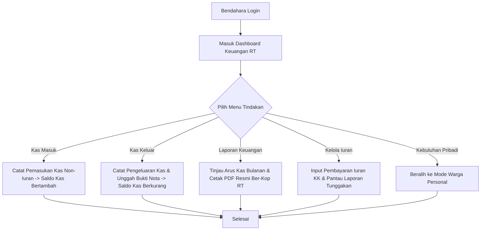
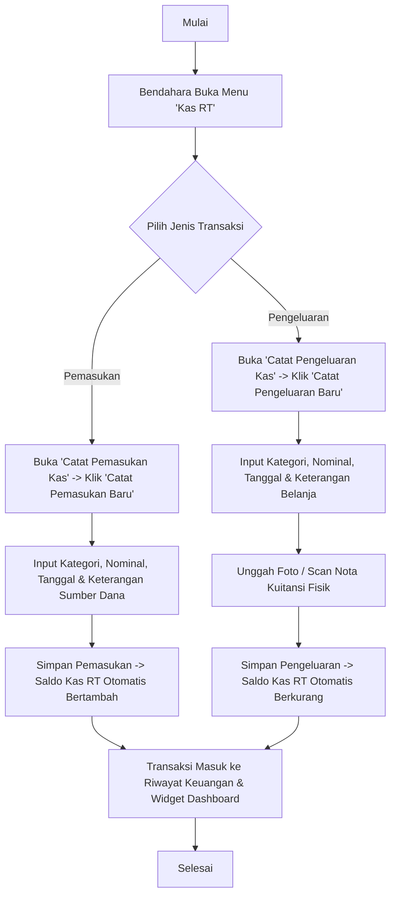
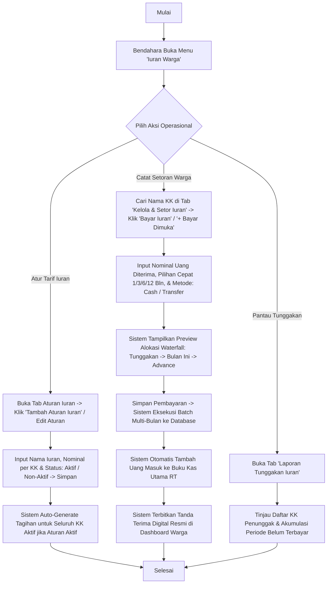
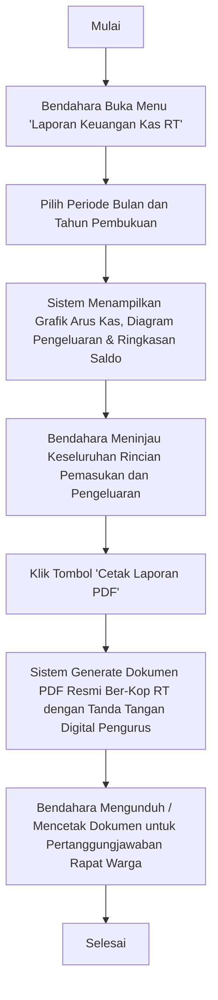

# Panduan Peran & Fitur: Bendahara

Bendahara bertanggung jawab penuh atas pembukuan dan pengelolaan keuangan kas RT, penagihan dan pencatatan setoran iuran warga, pelaporan arus kas secara transparan dan akuntabel, serta penerbitan laporan keuangan resmi ber-kop surat RT.

---

## 1. Navigasi & Struktur Menu (Sitemap)

Ketika Bendahara login ke sistem, menu navigasi sidebar meliputi:

*   **Dashboard:** Ringkasan metrik saldo kas RT, capaian iuran warga, perbandingan arus kas bulan ini, dan riwayat transaksi terkini (`/dashboard`).
*   **Kas RT (Cashflow):** (Menu Dropdown Accordion)
    *   **Catat Pemasukan Kas:** Pencatatan dan pengelolaan kas masuk RT di luar iuran warga (donasi, sumbangan, sewa fasilitas) (`/dashboard/cash/income`).
    *   **Catat Pengeluaran Kas:** Pencatatan dan pengelolaan kas keluar operasional RT disertai unggah bukti nota kuitansi fisik (`/dashboard/cash/expense`).
    *   **Laporan Keuangan Kas RT:** Rekapitulasi pembukuan kas bulanan, diagram kategori, dan ekspor cetak PDF laporan keuangan resmi ber-kop RT (`/dashboard/cash/reports`).
*   **Iuran Warga:** (Menu Dropdown Accordion)
    *   **Kelola & Setor Iuran:** Pengaturan aturan tarif iuran dan pencatatan setoran iuran warga per periode (`/dashboard/dues/manage`).
    *   **Laporan Tunggakan Iuran:** Rekapitulasi status pembayaran dan pemantauan daftar tunggakan iuran seluruh KK (`/dashboard/dues/arrears`).
*   **Fitur Personal (Mode Warga):** Melalui fitur *Switch Role* di Navbar, Bendahara dapat beralih ke *Mode Warga Personal* untuk mengelola data keluarga pribadi (`/dashboard/family`), melihat peta tetangga (`/dashboard/neighborhood`), histori iuran mandiri (`/dashboard/my-fees`), dan aset properti milik sendiri (`/dashboard/my-properties`).

---

## 2. Fitur & Tugas Utama

*   **BE-01: Dashboard Keuangan RT (Financial Center)**
    Merupakan panel kendali utama Bendahara untuk memantau kesehatan finansial RT secara real-time:
    *   **A. 4 KPI Cards Ringkasan Keuangan:**
        *   `Total Saldo Kas RT`: Akumulasi saldo kas riil (Total Pemasukan dikurangi Total Pengeluaran).
        *   `Pemasukan Bulan Ini`: Akumulasi uang masuk (setoran iuran warga + pemasukan non-iuran) pada bulan berjalan.
        *   `Pengeluaran Bulan Ini`: Total uang keluar yang dibelanjakan pada bulan berjalan.
        *   `Capaian Iuran Bulan Ini`: Persentase dan rasio Kepala Keluarga (KK) yang telah melunasi iuran pada periode aktif (misal: *"85% KK Lunas (34 dari 40 KK Terbayar)"*).
    *   **B. Cashflow Overview Card:**
        *   `Perbandingan Arus Kas`: Visualisasi persentase dan nominal pemasukan vs pengeluaran bulan ini.
        *   `Net Cashflow (Selisih Bersih)`: Menampilkan angka surplus/defisit kas bulan berjalan secara real-time.
        *   `Status Kepatuhan Iuran (Dues Compliance)`: Rekap perbandingan KK yang sudah lunas vs belum lunas.
    *   **C. Recent Transactions Widget:**
        *   Tabel transaksi keuangan terkini dengan badge tipe pemasukan/pengeluaran, kategori, tanggal, nominal, dan tautan pratinjau bukti nota kuitansi digital.

*   **BE-02: Pencatatan Kas Masuk (Income Management - `/dashboard/cash/income`)**
    *   Mencatat penerimaan kas RT non-iuran (donasi sukarela, dana sumbangan perayaan 17 Agustus, sewa aula/lapangan RT).
    *   Setiap input kas masuk otomatis menambah saldo kas utama secara real-time.
    *   Dilengkapi fitur filter pencarian, pengurutan, pengeditan, dan penghapusan transaksi.

*   **BE-03: Pencatatan Kas Keluar (Expense Management - `/dashboard/cash/expense`)**
    *   Mencatat pengeluaran kas operasional RT (biaya kebersihan, penerangan jalan, perbaikan fasilitas umum, konsumsi rapat warga).
    *   **Opsional mengunggah bukti nota / scan kuitansi fisik** sebagai bukti pertanggungjawaban digital.
    *   Tersedia pratinjau dokumen nota melalui modal penampil berkas aman (*SecureDocumentLink*).
    *   Setiap pengeluaran kas yang tersimpan otomatis memotong saldo kas utama secara real-time.

*   **BE-04: Laporan Keuangan Resmi & Cetak PDF (`/dashboard/cash/reports`)**
    *   Pemilihan periode laporan bulanan dan tahunan secara fleksibel.
    *   Visualisasi diagram tren arus kas dan diagram alokasi pengeluaran per kategori.
    *   **Cetak Dokumen PDF Resmi:** Menghasilkan dokumen laporan pertanggungjawaban keuangan resmi ber-kop surat RT lengkap dengan kolom tanda tangan digital Bendahara dan Ketua RT.

*   **BE-05: Pengelolaan Iuran Warga & Tunggakan (`/dashboard/dues`)**
    *   **Konfigurasi Aturan Iuran (`fee_rules`):** Menetapkan nama iuran dan nominal tarif bulanan per KK (misal: Rp 50.000/bulan). Seluruh aturan iuran bersifat **100% Wajib** secara default. Bendahara dapat mengubah status aturan menjadi **Aktif** atau **Non-Aktif** (aturan non-aktif menghentikan pembuatan tagihan baru, menonaktifkan tombol generate, dan diposisikan di urutan paling bawah).
    *   **Generate Tagihan Iuran & Auto-Billing:** 
        *   *Auto-Billing Pasif (JIT):* Sistem secara otomatis men-generate tagihan bulan berjalan saat pengurus atau warga membuka menu iuran.
        *   *Saat Pembuatan Aturan:* Saat aturan aktif baru dibuat, sistem langsung meng-generate tagihan bulan berjalan untuk seluruh KK aktif.
        *   *Tombol Generate Manual:* Tersedia pada kartu aturan aktif untuk sinkronisasi tagihan KK yang baru terdaftar.
    *   **Pencatatan Pembayaran Multi-Periode & Advance Payment (`/dashboard/dues/manage`):**
        *   *Waterfall Settlement:* Sistem secara cerdas mengalokasikan setoran warga secara berurutan: melunasi tunggakan terlama $\rightarrow$ melunasi tagihan bulan berjalan $\rightarrow$ mencatat pembayaran di muka (*Advance Payment*) untuk bulan-bulan mendatang.
        *   *Presisi Filter 'Semua Periode':* Batas kewajiban riil dihitung sampai bulan berjalan ($\le \text{currentPeriod}$), sehingga pembayaran di muka tidak membuat warga keliru berstatus "Kurang Bayar".
        *   *Simulasi Alokasi Modal:* Modal pembayaran menampilkan pratinjau kartu alokasi periode dan sisa nominal parsial secara real-time.
        *   *Sinkronisasi Kas Otomatis:* Setiap pembayaran langsung dicatat sebagai transaksi kas masuk (`income` / `Iuran Warga`) pada kas utama RT.
        *   *Tanda Terima Digital:* Pembayaran otomatis terbit di akun warga sebagai riwayat transaksi resmi (`/dashboard/my-fees`).
    *   **Laporan Tunggakan Iuran (`/dashboard/dues/arrears`):** Rekapitulasi daftar KK yang menunggak pembayaran iuran lampau dan bulan berjalan beserta total akumulasi nominal untuk monitoring penagihan.

*   **BE-06: Fitur Dual Role (Mode Warga Personal)**
    *   Bendahara RT dapat berganti peran secara instan ke *Mode Warga Personal* untuk mengelola data anggota keluarganya sendiri, memantau iuran pribadi, dan melihat aset sewa pribadi tanpa perlu keluar dari akun.

---

## 3. Alur Kerja Utama (Flowchart)

---

## 4. Alur Kerja Detail (User Flow)

### 4.1 Flow Pencatatan Kas Masuk & Kas Keluar

### 4.2 Flow Pengelolaan Iuran Warga & Penanganan Tunggakan

### 4.3 Flow Penyusunan & Pencetakan Laporan Keuangan Bulanan

