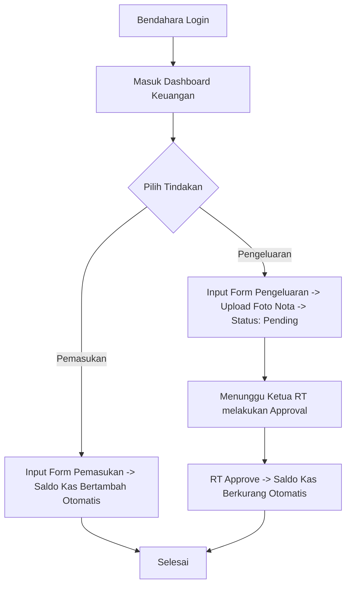

# Panduan Peran & Fitur: Bendahara

Bendahara bertanggung jawab penuh atas pencatatan dan pengelolaan keuangan kas RT, pelaporan saldo kas secara transparan, serta penyediaan bukti transaksi digital.

---

## 1. Navigasi & Struktur Menu (Sitemap)

Ketika Bendahara login, menu sidebar utama meliputi:
*   **Dashboard Keuangan:** Tampilan grafik kas, saldo kas RT saat ini, dan status tagihan iuran global.
*   **Kas RT (Pemasukan & Pengeluaran):** (Menu Utama)
    *   **Catat Pemasukan (Income):** (Sub-menu) Pencatatan uang masuk non-iuran bulanan (donasi, sumbangan, dll.).
    *   **Catat Pengeluaran (Expense):** (Sub-menu) Pencatatan uang keluar beserta upload bukti nota (status pending menunggu persetujuan Ketua RT).
*   **Iuran Warga:** (Menu Utama)
    *   **Kelola Iuran & Konfigurasi:** (Sub-menu) Konfigurasi tarif, inisialisasi awal, dan input setoran iuran warga.
    *   **Laporan Tunggakan:** (Sub-menu) Rekapitulasi KK yang menunggak iuran bulanan berjalan/lalu untuk penagihan.

---

### 2. Fitur & Tugas Utama

*   **BE-01: Dashboard Keuangan (Dashboard Utama Bendahara)**
    Merupakan panel kendali utama Bendahara untuk memantau kesehatan finansial RT secara real-time yang secara otomatis tersinkron dengan halaman laporan keuangan warga:
    *   **Kartu Ringkasan Keuangan (Financial Summary Cards):**
        *   `Saldo Kas RT Saat Ini`: Angka saldo riil kumulatif (Total Pemasukan - Pengeluaran yang sudah disetujui RT).
        *   `Pemasukan Bulan Ini`: Akumulasi uang masuk (iuran + donasi) di bulan berjalan.
        *   `Pengeluaran Bulan Ini`: Akumulasi uang keluar yang telah disetujui RT di bulan berjalan.
    *   **Visualisasi Grafik Keuangan (Charts):**
        *   `Grafik Cashflow Bulanan`: Diagram batang/garis perbandingan Pemasukan vs Pengeluaran dari bulan ke bulan untuk memantau tren surplus/defisit.
        *   `Diagram Lingkaran Kategori Pengeluaran (Pie Chart)`: Membagi alokasi pengeluaran kas berdasarkan kategori (misal: 40% operasional sampah, 30% hansip, 20% sosial, 10% administrasi) guna mengevaluasi efisiensi anggaran.
    *   **Metrik Partisipasi Iuran (Dues Participation Metric):**
        *   `Rasio Lunas Bulanan`: Persentase jumlah Kepala Keluarga yang sudah melunasi iuran wajib pada bulan berjalan (contoh: "85% KK Telah Lunas").
        *   `Estimasi Tunggakan Kas RT`: Total rupiah tagihan iuran wajib yang belum terkumpul dari KK yang menunggak untuk bulan berjalan dan bulan-bulan sebelumnya.
    *   **Widget Pantauan Pengeluaran Tertunda (Pending Expense Widget):**
        *   Menampilkan daftar transaksi pengeluaran yang statusnya masih `Pending` (menunggu persetujuan Ketua RT) agar Bendahara dapat segera mengingatkan Ketua RT untuk melakukan approval.
*   **BE-02: Pencatatan Pemasukan (Income - CRUD)**
    Mencatat uang masuk kas RT (non-iuran bulanan, seperti donasi sosial, sumbangan 17 Agustus) lengkap dengan sumber dana, jumlah nominal, tanggal transaksi, dan keterangan. Saldo kas utama akan otomatis bertambah.
*   **BE-03: Pencatatan Pengeluaran (Expense - CRUD + Bukti)**
    *   Mencatat draf uang keluar (kategori: perbaikan fasilitas, kebersihan, konsumsi rapat, dll.) lengkap dengan jumlah, tanggal, dan deskripsi.
    *   **Wajib mengunggah scan/foto nota kuitansi** sebagai bukti fisik.
    *   Status pengeluaran berstatus `Pending` dan tidak memotong saldo kas utama sebelum disetujui/di-approve oleh Ketua RT.
*   **BE-04: Kelola Iuran & Pemantauan Tunggakan**
    *   **Inisialisasi Pertama Kali (Setup Awal):** Saat pertama kali sistem digunakan, tidak ada tarif default. Sistem menampilkan petunjuk setup awal yang bersih. Bendahara wajib membuat aturan iuran pertama kali agar tagihan otomatis mulai berjalan bagi seluruh Kepala Keluarga terdaftar.
    *   **Konfigurasi Tarif Iuran:** Menetapkan nama iuran dan nominal tarif per Kepala Keluarga (misal: Rp 50.000/bulan) serta memberikan label:
        *   *Iuran Wajib (is_mandatory = true):* Bersifat mengikat. Jika tidak dibayar, akan diakumulasikan sebagai "Tunggakan Wajib" keluarga.
        *   *Iuran Sukarela / Donasi (is_mandatory = false):* Bersifat opsional (misal: sumbangan 17an). Jika warga tidak membayar, status tetap `unpaid` namun tidak dihitung sebagai tunggakan hutang.
    *   **Otomatisasi Tagihan Bulanan:** Setelah tarif di-set pertama kali, sistem otomatis men-generate baris tagihan baru (`unpaid`) untuk seluruh KK terverifikasi setiap awal bulan berjalan.
    *   **Pencatatan Pembayaran Warga (Pelunasan / Cicilan):** Ketika warga menyetor iuran, Bendahara mencari nama KK pemohon, meng-klik **`[Bayar Iuran]`**, dan menginput nominal uang yang diserahkan. 
        *   *Jika bayar penuh:* Status tagihan berubah menjadi **`Lunas` (paid)**.
        *   *Jika bayar setengah/sebagian (dicicil):* Bendahara menginput nominal kustom (misal: Rp 25.000 dari total Rp 50.000), sistem otomatis mencatat nominal terbayar tersebut, menyisakan kekurangan sisa tagihan di dashboard, dan mengubah status tagihan menjadi **`Kurang` (partially_paid)**.
        *   *Sinkronisasi Kas:* Sistem otomatis mencatat uang masuk ke kas utama pemasukan (`income`) **hanya sebesar nominal yang disetorkan saat itu** (misal Rp 25.000).
        *   *Tanda Terima Digital Warga:* Setoran iuran yang disimpan Bendahara di sini secara otomatis akan terbit sebagai **Riwayat Transaksi resmi di dashboard warga** yang bertindak sebagai tanda terima digital. Warga tidak dapat menginput/memanipulasi riwayat iurannya sendiri tanpa verifikasi Bendahara.
    *   **Laporan Tunggakan:** Menampilkan tabel rekapitulasi KK yang menunggak iuran bulanan berjalan beserta riwayat tunggakan bulan-bulan sebelumnya guna memudahkan penagihan.

---

## 3. Alur Kerja Utama (Flowchart)



---

## 4. Alur Kerja Detail (User Flow)

### 4.1 Flow Pengelolaan Keuangan (Bendahara)

```mermaid
flowchart TD
    A[Mulai] --> B[Bendahara buka menu Keuangan]
    B --> C{Pilih aksi}
    
    C -->|Input Pemasukan| D[Isi form: sumber, jumlah, tanggal, keterangan]
    D --> E[Simpan Pemasukan]
    E --> F[Saldo kas utama otomatis bertambah secara real-time]
    F --> G[Selesai]
    
    C -->|Input Pengeluaran| H[Isi form: kategori, jumlah, tanggal, keterangan]
    H --> I[Upload foto/scan bukti kuitansi nota]
    I --> J[Simpan Pengeluaran -> Status: Pending]
    J --> K[Ketua RT menerima notifikasi approval pengeluaran]
    K --> L{RT Menyetujui?}
    L -->|Ya| M[RT klik Approve]
    M --> N[Status: Approved -> Saldo kas utama resmi berkurang]
    L -->|Tidak| O[RT klik Tolak & isi alasan]
    O --> P[Status: Rejected -> Saldo kas tidak berubah]
    N --> G
    P --> G

### 4.2 Flow Pengelolaan Iuran Warga (Bendahara)

```mermaid
flowchart TD
    A[Mulai] --> B[Bendahara buka menu Kelola Iuran Warga]
    B --> C{Apakah tarif iuran sudah di-set?}
    
    %% Setup Pertama Kali
    C -->|Tidak, Belum Ada| D[Tampil Petunjuk Setup Awal]
    D --> E[Bendahara Klik '+ Buat Aturan Iuran']
    E --> F[Input: Nama Iuran, Nominal & Label Wajib/Sukarela]
    F --> G[Simpan -> Sistem otomatis generate tagihan bulan ini untuk seluruh KK aktif]
    G --> H[Masuk ke Halaman Utama Kelola Iuran]
    
    %% Halaman Utama & Bayar
    C -->|Ya, Sudah Ada| H
    H --> I{Pilih Aksi}
    
    I -->|Pencatatan Bayar| J[Cari Nama KK & Klik 'Bayar Iuran']
    J --> K[Input nominal uang diserahkan warga & metode]
    K --> L{Apakah nominal lunas?}
    L -->|Ya, Penuh| M[Sistem set status: Lunas]
    L -->|Tidak, Sebagian| N[Sistem set status: Kurang & catat sisa kekurangan]
    
    M --> O[Sistem sinkronisasi otomatis catat pemasukan kas utama]
    N --> O
    O --> P[Sistem terbitkan Tanda Terima Digital di Beranda Warga]
    P --> Q[Selesai]
    
    %% Laporan Tunggakan
    I -->|Pantau Tunggakan| R[Buka Tab Laporan Tunggakan]
    R --> S[Tampil rekap daftar KK penunggak & nominal tunggakan]
    S --> T[Ekspor daftar ke Excel / PDF untuk penagihan keliling]
    T --> Q
```
```
