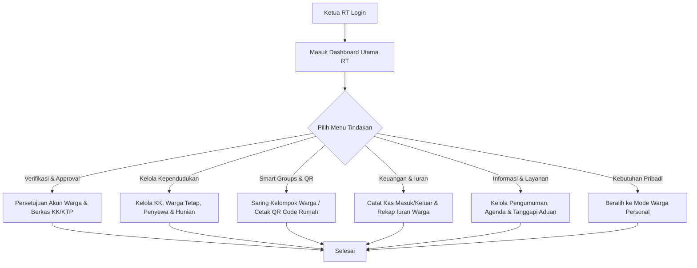
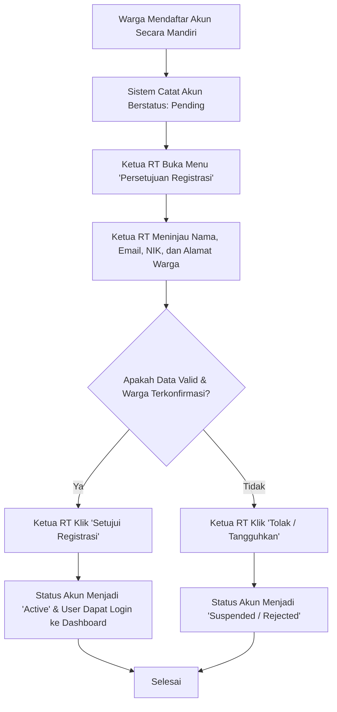
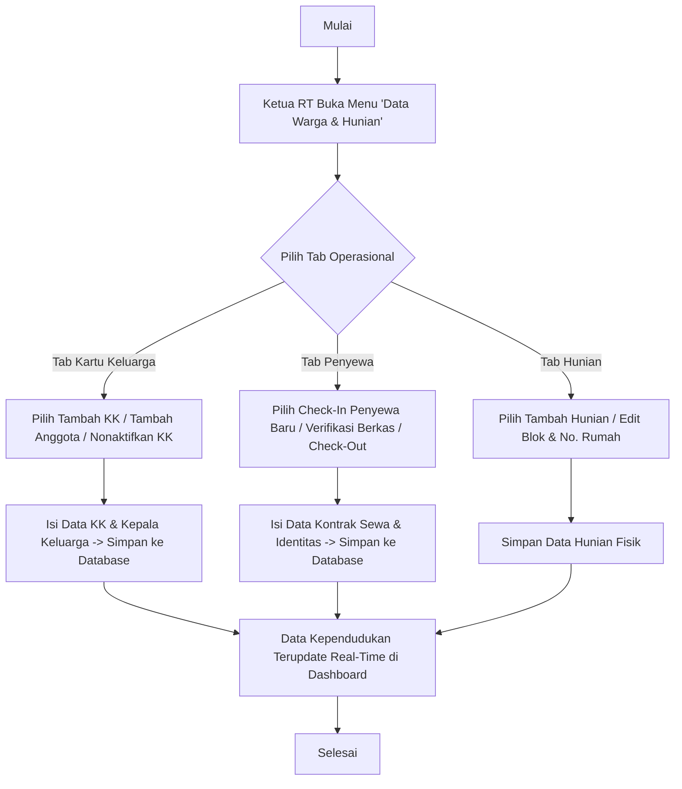
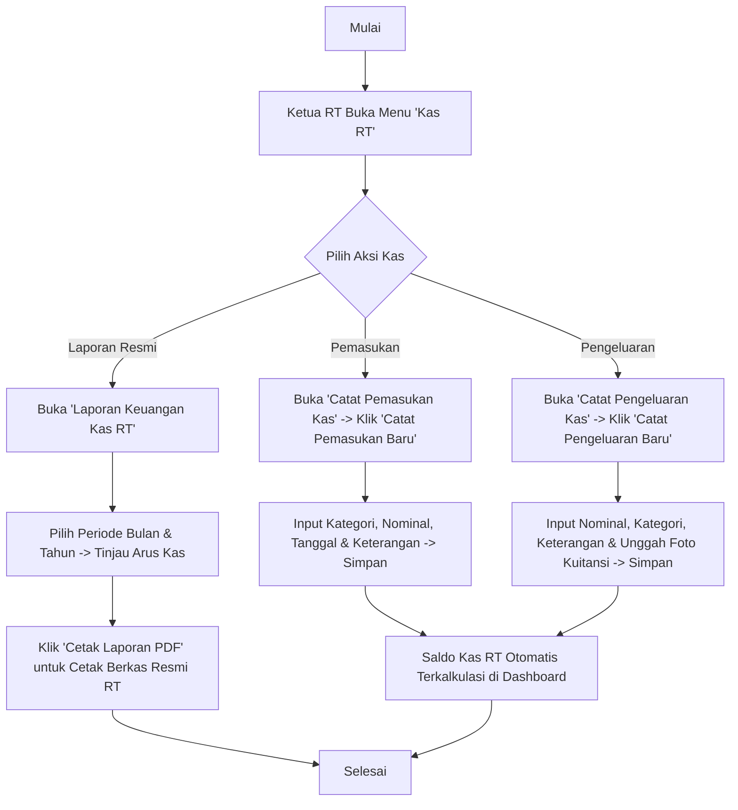
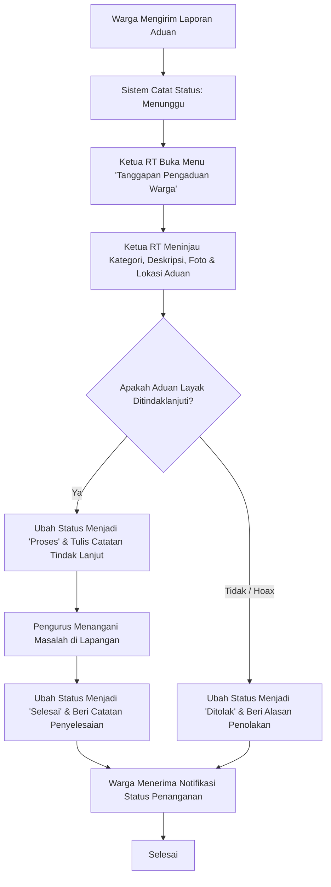
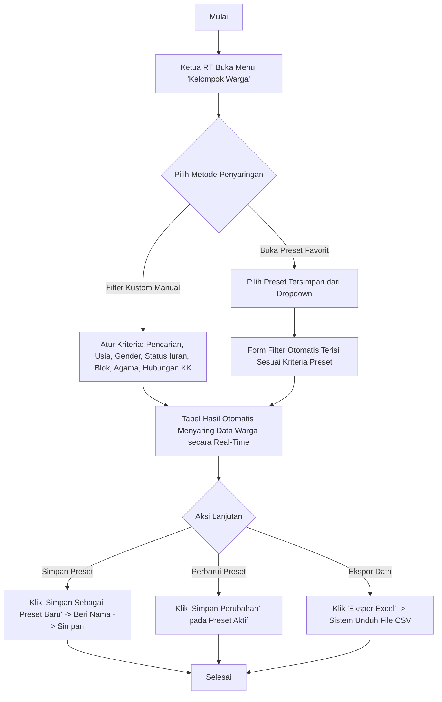

# Panduan Peran & Fitur: Ketua RT

Ketua RT adalah pemimpin utama di wilayah Rukun Tetangga yang memiliki kewenangan penuh dalam pengesahan data kependudukan, verifikasi pendaftaran dan berkas warga, pengelolaan kas & iuran RT, publikasi informasi kegiatan lingkungan, serta penanganan keluhan warga.

---

## 1. Navigasi & Struktur Menu (Sitemap)

Ketika Ketua RT login ke sistem, menu navigasi sidebar meliputi:

*   **Dashboard:** Panel komprehensif metrik demografi, keuangan kas RT, mutasi penduduk, okupansi hunian, dan rekapitulasi pengaduan warga (`/dashboard`).
*   **Modul Kependudukan & Hunian RT:** (Menu Dropdown Accordion)
    *   **Data Warga & Hunian:** Pengelolaan data Kartu Keluarga (KK), warga tetap, penyewa kontrak/kos, data hunian fisik, dan akun koordinator kos (`/dashboard/residents`).
    *   **Kelompok Warga:** Pembuatan kelompok warga dinamis berbasis kriteria kustom terfilter (Smart Groups) (`/dashboard/smart-groups`).
    *   **Cetak QR Code RT:** Pembuatan, pengunduhan individual, dan pencetakan massal PDF QR Code hunian & sekretariat (`/dashboard/qr-codes`).
*   **Antrean Persetujuan:** (Menu Dropdown Accordion)
    *   **Persetujuan Registrasi:** Verifikasi permohonan pendaftaran akun warga baru (`/dashboard/approvals/registration`).
    *   **Verifikasi Kependudukan:** Verifikasi berkas scan KK dan KTP warga serta penyewa kos (`/dashboard/approvals/documents`).
*   **Kas RT (Cashflow):** (Menu Dropdown Accordion)
    *   **Catat Pemasukan Kas:** Pencatatan dan pengelolaan kas masuk RT di luar iuran warga (`/dashboard/cash/income`).
    *   **Catat Pengeluaran Kas:** Pencatatan dan pengelolaan kas keluar RT disertai unggah bukti nota kuitansi (`/dashboard/cash/expense`).
    *   **Laporan Keuangan Kas RT:** Rekapitulasi kas bulanan, grafik per kategori, dan ekspor cetak PDF laporan keuangan resmi ber-kop surat RT (`/dashboard/cash/reports`).
*   **Iuran Warga:** (Menu Dropdown Accordion)
    *   **Kelola & Setor Iuran:** Pengaturan aturan tarif iuran dan pencatatan setoran iuran warga per periode (`/dashboard/dues/manage`).
    *   **Laporan Tunggakan Iuran:** Rekapitulasi status pelunasan dan data tunggakan iuran seluruh KK (`/dashboard/dues/arrears`).
*   **Portal Informasi & Layanan:** (Menu Dropdown Accordion)
    *   **Kelola Pengumuman:** Pembuatan, penyuntingan, dan penerbitan pengumuman warga (`/dashboard/announcements`).
    *   **Kelola Kegiatan RT:** Penjadwalan agenda kegiatan dan event lingkungan RT (`/dashboard/activities`).
    *   **Tanggapan Pengaduan Warga:** Penanganan, penulisan respon, dan pembaruan status laporan keluhan warga (`/dashboard/complaints`).
*   **Kelola Penyewa Kos:** Pengawasan dan pengelolaan data rumah sewa, unit kos, dan penghuni sewa (`/dashboard/rentals`).
*   **Fitur Personal (Mode Warga):** Melalui fitur *Switch Role* di Navbar, Ketua RT dapat beralih ke *Mode Warga Personal* untuk mengelola data keluarga pribadi (`/dashboard/family`), melihat direktori tetangga (`/dashboard/neighborhood`), histori iuran mandiri (`/dashboard/my-fees`), dan aset properti milik sendiri (`/dashboard/my-properties`).

---

## 2. Fitur & Tugas Utama

*   **KT-01: Dashboard Utama & Statistik Wilayah (Komprehensif)**
    Menampilkan analitik data wilayah RT secara real-time dan interaktif:
    *   **A. KPI Cards Ringkasan:**
        *   `Total Rumah`: Jumlah total bangunan fisik rumah terdaftar di RT.
        *   `Total Penduduk`: Jumlah kumulatif warga aktif (warga tetap + penyewa aktif).
        *   `Kepala Keluarga`: Total Kartu Keluarga (KK) yang aktif terdaftar.
        *   `Anak Kos`: Total penyewa kos/kontrakan perorangan yang aktif menghuni.
    *   **B. Mutasi Penduduk:**
        *   Grafik batang mutasi 6 bulan terakhir: Perbandingan warga baru masuk (*check-in*) vs warga keluar/pindah (*check-out*).
    *   **C. Demografi & Sosial Warga:**
        *   `Sebaran Domisili KTP`: Analisis persentase warga ber-KTP Kelurahan Setempat vs Luar Kelurahan dengan rincian breakdown warga tetap dan penyewa.
        *   `Rasio Gender`: Grafik perbandingan Laki-laki vs Perempuan.
        *   `Kelompok Usia`: Pengelompokan usia warga (Anak 0-11 th, Remaja 12-17 th, Dewasa 18-59 th, Lansia 60+ th).
        *   `Keberagaman Sosial`: Diagram sebaran Agama, Tingkat Pendidikan, dan Jenis Pekerjaan warga.
    *   **D. Keuangan & Hunian:**
        *   `Ringkasan Arus Kas`: Saldo kas riil saat ini, nominal iuran tertagih vs terbayar, rasio partisipasi iuran KK, dan grafik tren arus kas bulanan (*Income vs Expense*).
        *   `Status Hunian & Okupansi`: Jumlah hunian terisi tetap, kos/homestay, hunian kosong, serta rasio okupansi kamar kos terisi vs kapasitas total.
    *   **E. Pengaduan Warga:**
        *   Rekapitulasi status aduan (*Menunggu, Proses, Selesai, Ditolak*) dan 5 kategori aduan terbanyak (Infrastruktur, Kebersihan, Keamanan, Sosial, dll.).

*   **KT-02: Pengelolaan Kependudukan & Hunian RT (`/dashboard/residents`)**
    *   **Manajemen Kartu Keluarga (KK):** Tambah data KK dan akun Kepala Keluarga, edit biodata keluarga, nonaktifkan KK (pindah/meninggal), dan aktifkan kembali data KK.
    *   **Manajemen Penyewa (Kos/Kontrakan):** Input *check-in* penyewa baru, verifikasi berkas identitas penyewa, pembaruan data sewa, dan pemrosesan *check-out*.
    *   **Manajemen Hunian Fisik:** Pendaftaran nomor rumah/blok, tipe hunian (permanen/kos/homestay), dan status hunian.
    *   **Manajemen Koordinator Kos:** Penunjukan akun koordinator kos baru, pembaruan data, dan penonaktifan akses koordinator.

*   **KT-03: Kelompok Warga Dinamis (Smart Groups) & Ekspor Data (`/dashboard/smart-groups`)**
    Menyajikan fitur penyaringan dan pencarian data warga terpadu secara akurat, instan, dan mudah dikustomisasi:
    *   **Filter Terpadu Multi-Kriteria:**
        *   `Pencarian Instan`: Cari cepat berdasarkan Nama Warga atau NIK (16 digit).
        *   `Rentang Usia`: Filter batas usia minimum (misal: 17 th) dan batas usia maksimum (misal: 60 th).
        *   `Jenis Kelamin`: Semua, Laki-laki (L), atau Perempuan (P).
        *   `Status Iuran RT`: Semua, Lunas (Lancar), atau Menunggak.
        *   `Tipe Tempat Tinggal`: Semua, Warga Tetap (Permanen), atau Kos / Sewa.
        *   `Blok Rumah`: Semua atau spesifik blok (Blok A, B, C, D, E).
        *   `Agama`: Semua atau pilihan agama resmi (Islam, Kristen, Katolik, Hindu, Buddha, Khonghucu).
        *   `Pekerjaan`: Input pencarian jenis pekerjaan (misal: Swasta, PNS, Wiraswasta, Buruh, Pelajar).
        *   `Hubungan Dalam Keluarga`: Multi-select checkbox (Kepala Keluarga, Suami, Istri, Anak, Orang Tua / Mertua, Lainnya).
    *   **Manajemen Preset Filter Favorit (Saved Groups):**
        *   *Simpan Sebagai Preset Baru:* Menyimpan kombinasi filter aktif dengan nama kustom (misal: *"Warga Lansia Menunggak Blok A"* atau *"Penerima Bantuan Sembako"*).
        *   *Buka Preset Tersimpan:* Memuat kembali konfigurasi filter tersimpan hanya dengan satu klik dari dropdown.
        *   *Perbarui Preset:* Mengupdate kriteria pada preset filter yang sedang aktif.
        *   *Hapus Preset:* Menghapus preset yang sudah tidak digunakan.
        *   *Reset Filter:* Mengembalikan seluruh kontrol filter ke kondisi default awal.
    *   **Hasil Penyaringan & Ekspor CSV/Excel:**
        *   Tabel hasil menampilkan rekapitulasi data warga terfilter (Nama, NIK, L/P, Usia, Hubungan, Blok & Rumah, Agama, Pekerjaan, dan Status Iuran).
        *   Tombol **`[Ekspor Excel]`** untuk mengunduh seluruh data warga yang tersaring ke format file CSV/Excel bertanda UTF-8 BOM (`daftar_warga_terfilter_[tanggal].csv`).

*   **KT-04: Antrean Persetujuan & Verifikasi Dokumen (`/dashboard/approvals`)**
    *   **Persetujuan Registrasi:** Meninjau dan menyetujui/menolak permohonan pendaftaran mandiri akun warga (`pending` -> `active` / `rejected`).
    *   **Verifikasi Berkas KK/KTP:** Memeriksa berkas scan KK dan KTP warga/penyewa untuk memastikan keabsahan data kependudukan (`pending` -> `verified` / `rejected`).

*   **KT-05: Pengelolaan Kas RT & Iuran Warga (`/dashboard/cash` & `/dashboard/dues`)**
    *   **Pencatatan Kas Masuk & Keluar:** Input transaksi pemasukan kas lain-lain dan pengeluaran kas operasional RT disertai bukti kuitansi fisik.
    *   **Laporan Keuangan Resmi:** Laporan buku kas bulanan dengan visualisasi diagram kategori dan fitur cetak dokumen PDF resmi bertanda tangan digital pengurus.
    *   **Iuran Warga:** Pembuatan aturan iuran (wajib/sukarela), input pembayaran iuran per periode, serta pemantauan rekapitulasi tunggakan iuran warga.

*   **KT-06: Portal Informasi & Penanganan Aduan Warga (`/dashboard/announcements`, `activities`, `complaints`)**
    *   **Kelola Pengumuman:** Publikasi berita, himbauan, dan informasi resmi warga dengan opsi *pin/unpin* pengumuman penting.
    *   **Kelola Agenda Kegiatan:** Penjadwalan jadwal kerja bakti, rapat warga, posyandu, atau peringatan hari besar.
    *   **Tanggapan Aduan Warga:** Penanganan laporan keluhan warga, pengisian catatan tindak lanjut, dan perubahan status aduan (*Menunggu* -> *Proses* -> *Selesai* / *Ditolak*).

*   **KT-07: Cetak QR Code RT (`/dashboard/qr-codes`)**
    *   Pencetakan dan pengunduhan QR Code nomor rumah/hunian warga dan sekretariat RT, baik secara satuan maupun cetak massal format PDF.

*   **KT-08: Fitur Dual Role (Mode Warga Personal)**
    *   Ketua RT dapat berganti peran secara instan ke *Mode Warga Personal* untuk mengelola data anggota keluarganya sendiri, memantau iuran pribadi, dan melihat aset sewa pribadi tanpa perlu keluar dari akun.

---

## 3. Alur Kerja Utama (Flowchart)

---

## 4. Alur Kerja Detail (User Flow)

### 4.1 Flow Persetujuan Registrasi Akun Warga Baru

### 4.2 Flow Pengelolaan Data Kependudukan & Hunian (Ketua RT)

### 4.3 Flow Pencatatan Kas RT & Laporan Keuangan

### 4.4 Flow Penanganan & Respon Pengaduan Warga

### 4.5 Flow Penyaringan Warga & Manajemen Preset (Smart Groups)

