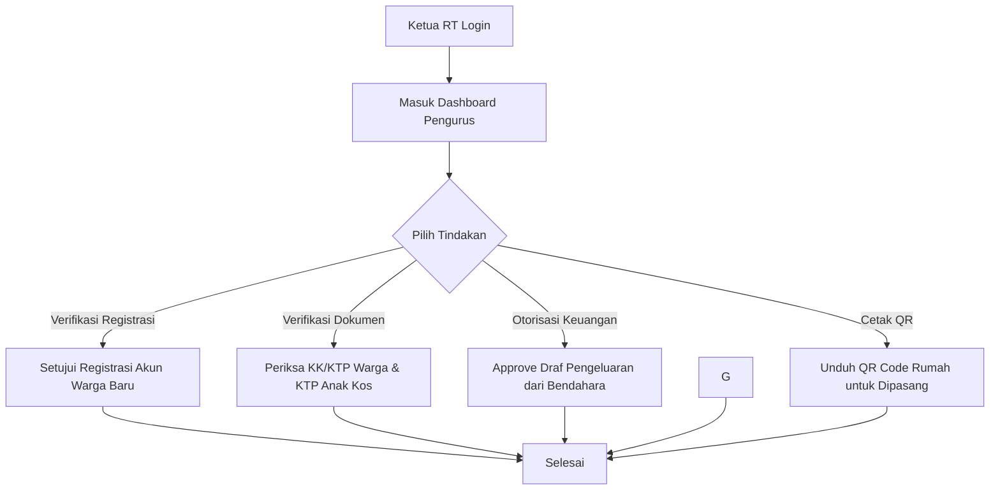
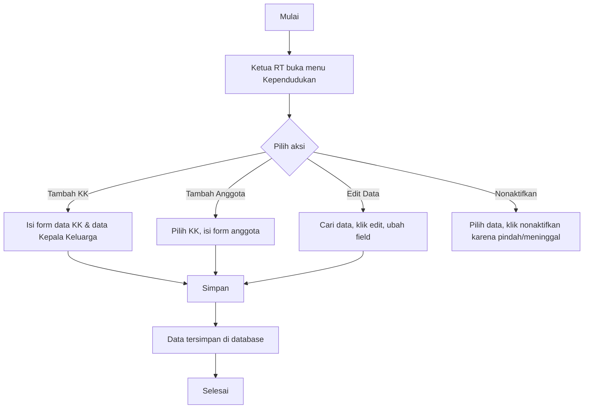

# Panduan Peran & Fitur: Ketua RT

Ketua RT adalah pemimpin utama di wilayah Rukun Tetangga yang memiliki hak pengesahan administrasi kependudukan, permohonan surat pengantar, pengeluaran keuangan kas, dan verifikasi warga.

---

## 1. Navigasi & Struktur Menu (Sitemap)

Ketika Ketua RT login, menu sidebar utama meliputi:
*   **Dashboard Utama:** Panel ringkasan statistik kependudukan RT, keuangan kas, pengaduan aktif, dan antrean persetujuan.
*   **Kelola Kependudukan:** (Menu Utama)
    *   **Data Warga & Hunian:** (Sub-menu) CRUD data warga tetap, KK, properti sewa, dan data penghuni sewa.
    *   **Kelompok Warga (Smart Group):** (Sub-menu) Pengelompokan warga dinamis berbasis kriteria kustom.
    *   **Cetak QR Code:** (Sub-menu) Mengunduh & mencetak QR Code hunian massal/individual.
*   **Antrean Persetujuan:** (Menu Utama)
    *   **Persetujuan Registrasi:** (Sub-menu / Tab) Approval pendaftaran akun warga baru.
    *   **Verifikasi Dokumen KK/KTP:** (Sub-menu / Tab) Approval berkas KK/KTP warga.
*   **Keuangan & Kas:** (Menu Utama)
    *   **Laporan Kas RT:** (Sub-menu) Pemantauan seluruh kas masuk dan kas keluar (read-only).
    *   **Otorisasi Pengeluaran:** (Sub-menu) Menyetujui/menolak draf pengeluaran yang diajukan Bendahara.
*   **Portal Informasi:** (Menu Utama)
    *   **Kelola Pengumuman:** (Sub-menu) CRUD pengumuman warga untuk publik & dashboard.
    *   **Kelola Kegiatan:** (Sub-menu) CRUD jadwal kegiatan RT.
*   **Otorisasi Surat:** (Menu Utama - Direct Link) Meninjau antrean permohonan surat masuk untuk dicetak & ditandatangani offline.
*   **Kelola Pengaduan:** (Menu Utama - Direct Link) Memperbarui status aduan masuk (Proses/Selesai).

---

## 2. Fitur & Tugas Utama

*   **KT-01: Dashboard Utama & Statistik Wilayah (Komprehensif)**
    Menampilkan visualisasi data statistik wilayah RT secara real-time dan interaktif untuk membantu Ketua RT mengambil keputusan kebijakan, yang dikelompokkan menjadi:
    *   **A. Statistik Utama Kependudukan:**
        *   `Total Warga Aktif`: Jumlah gabungan warga tetap dan penghuni sewa yang berstatus aktif terverifikasi.
        *   `Total Kepala Keluarga (KK)`: Jumlah KK terdaftar (KK warga tetap dan KK warga sewa).
        *   `Total Warga Tetap`: Jumlah warga yang memiliki status KK setempat.
        *   `Total Pendatang (Penyewa Sewaan)`: Jumlah total warga yang berstatus sebagai penyewa (kos/kontrakan).
        *   `Mutasi Penduduk`: Grafik tren jumlah warga baru masuk (check-in) vs warga keluar/pindah (check-out) per bulan sepanjang tahun berjalan.
    *   **B. Demografi & Sosial Warga:**
        *   `Rasio Gender`: Grafik lingkaran perbandingan jumlah warga Laki-laki vs Perempuan.
        *   `Distribusi Usia (Piramida Usia)`: Pengelompokan usia warga (Balita: 0-5 th, Anak: 6-12 th, Remaja: 13-18 th, Produktif: 19-59 th, Lansia: >=60 th).
        *   `Sebaran Pekerjaan`: Persentase jenis pekerjaan warga (PNS, Swasta, Wiraswasta, TNI/Polri, Pelajar/Mahasiswa, Tidak Bekerja, dll.).
        *   `Tingkat Pendidikan`: Persentase pendidikan terakhir warga (SD, SMP, SMA, Diploma, S1, S2/S3).
        *   `Sebaran Agama`: Jumlah pemeluk agama di wilayah RT untuk kerukunan sosial.
    *   **C. Statistik Properti & Hunian:**
        *   `Status Hunian Rumah`: Jumlah rumah fisik terisi keluarga tetap, aktif disewakan (kos/kontrakan), aktif homestay, dan rumah kosong tak berpenghuni.
        *   `Rasio Okupansi Kamar Kos/Kontrakan`: Persentase jumlah kamar sewa terisi vs total kapasitas kamar sewa keseluruhan di wilayah RT.
    *   **D. Ringkasan Keuangan Kas RT:**
        *   `Saldo Kas Saat Ini`: Total saldo kas aktual (Pemasukan dikurangi Pengeluaran disetujui).
        *   `Rasio Partisipasi Iuran`: Persentase Kepala Keluarga yang tertib membayar iuran bulanan berjalan vs menunggak.
        *   `Tren Arus Kas (Cashflow)`: Grafik batang bulanan pemasukan kas vs pengeluaran kas.
    *   **E. Statistik Pengaduan (Laporan):**
        *   `Status Aduan`: Jumlah aduan berkategori `Menunggu`, `Proses`, dan `Selesai`.
        *   `Topik Aduan Terbanyak`: Kategori aduan yang paling sering dilaporkan warga (Keamanan, Kebersihan, Ketertiban, Fasilitas Umum).
*   **KT-02: Kelola Kependudukan & Verifikasi Dokumen**
    *   **CRUD Data Kependudukan:** Mengelola data rumah tinggal (`dwellings`), Kartu Keluarga (`families`), data warga tetap (`family_members`), properti sewa (`rental_properties`), dan data penghuni sewa (`rental_residents`).
    *   **Verifikasi Dokumen KK & KTP:** Memeriksa scan KK/KTP yang diunggah warga atau berkas (KTP/KK) penyewa yang diinput Koordinator Sewa. Mengubah status berkas menjadi `Verified` atau `Rejected`.
*   **KT-03: Kelola Keuangan (Otorisasi Pengeluaran Kas)**
    Meninjau bukti nota pengeluaran kas yang diinput oleh Bendahara. Ketua RT berwenang memberikan otorisasi (menyetujui atau menolak) pengeluaran tersebut agar saldo kas RT resmi berkurang di pembukuan sistem.
*   **KT-04: Kelola Pengumuman**
    Membuat, mengedit, atau menghapus informasi/pengumuman penting warga yang akan tampil di halaman Beranda Publik dan Dashboard Warga.
*   **KT-05: Kelola Kegiatan**
    Membuat, mengedit, atau menghapus jadwal kegiatan RT (seperti rapat warga, kerja bakti, posyandu, siskamling) agar warga bisa melihat dan mendapat notifikasi pengingat.
*   **KT-06: Administrasi Surat Pengantar (Hybrid)**
    *   **Menyetujui & Memproses Surat (Offline):** Ketua RT meninjau antrean permohonan surat masuk (status `Menunggu Review`) atau memproses draf fisik yang disodorkan Sekretaris (status `Sedang Diproses`).
    *   **Tanda Tangan & Stempel Basah:** Ketua RT menandatangani dan membubuhkan stempel basah pada surat pengantar fisik secara manual (offline).
*   **KT-07: Kelola Pengaduan Warga**
    Memantau laporan pengaduan masalah warga (kebersihan, ketertiban, infrastruktur rusak) yang masuk melalui portal publik atau login warga, serta memperbarui status penanganannya (`Proses` atau `Selesai`).
*   **KT-08: Verifikasi Registrasi Warga**
    Menyetujui pendaftaran mandiri Kepala Keluarga baru. Mengubah status akun mereka dari `Pending` menjadi `Active` untuk membuka akses dashboard.
*   **KT-09: Cetak QR Code Rumah**
    *   Mengunduh berkas gambar/PDF QR Code untuk setiap rumah (`dwelling`) di wilayahnya untuk dipasang di dinding luar rumah warga.
    *   **Menu Akses Unduh QR Code:** Pengurus RT dapat melihat, mengunduh secara individual, atau mengunduh massal seluruh QR Code wilayah melalui **Menu: Cetak QR Code** -> Pilih Rumah/Properti -> Klik Tombol **`[Unduh QR Code]`** or **`[Cetak Massal PDF]`**.
*   **KT-10: Pengelompokan Warga Dinamis (Smart Grouping) & Ekspor Data**
    Menyajikan fitur pencarian dan pengelompokan warga secara dinamis bagi Ketua RT untuk berbagai keperluan (seperti pendataan calon penerima bantuan, sensus kelompok tertentu, atau kegiatan sosial) menggunakan antarmuka **Visual Rule Builder**:
    *   **Visual Rule Builder & Pembobotan Kelayakan:** Ketua RT dapat membuat kelompok warga (misal: *Grup Calon Penerima Sembako*, *Grup Lansia Mandiri*) dengan menyusun kriteria penyaringan kustom:
        *   *Kolom Kependudukan (Field):* Memilih kolom data dari dropdown yang mencakup dua tingkat data:
            *   *Tingkat Individu:* Nama, NIK, Usia, Pekerjaan, Hubungan Keluarga (Kepala Keluarga, Istri, Anak, dll.), Pendidikan Terakhir, Agama.
            *   *Tingkat Keluarga (Relasional Lintas-Tabel):* Pekerjaan Kepala Keluarga (sangat berguna untuk menyaring anak/anggota keluarga berdasarkan pekerjaan kepala keluarganya), Status Iuran Keluarga (Lancar/Menunggak), Jumlah Tanggungan KK (Jumlah Anggota KK).
        *   *Operator Logika:* Memilih operator perbandingan lengkap:
            *   Sama dengan (`==`)
            *   Tidak sama dengan (`!=`)
            *   Lebih besar (`>`) atau Lebih besar sama dengan (`>=`)
            *   Kurang dari (`<`) atau Kurang dari sama dengan (`<=`)
            *   Di dalam daftar (`IN`) atau Tidak di dalam daftar (`NOT IN`)
        *   *Nilai (Value):* Menginput nilai pembanding (misal angka usia `12`) atau memilih beberapa opsi sekaligus (misal pada operator `IN`: memilih `Petani` dan `Buruh` secara bersamaan).
        *   *Bobot Poin (Weight - Opsional):* Menentukan skor nilai tambah jika kriteria tersebut terpenuhi (misal: +40 poin) untuk mengurutkan warga dari yang paling mendekati kriteria.
    *   **Penumpukan Filter (Filter Stacking):** RT dapat menumpuk lebih dari satu baris filter kriteria sekaligus dengan dua mode pengaturan logika utama:
        1.  **Gerbang Logika Global (Global Operator):** Ketua RT dapat memilih hubungan logika antarfiber yang ditumpuk di bagian atas form:
            *   **Mode "DAN (AND)":** Warga wajib memenuhi **seluruh** kriteria filter yang ditumpuk agar masuk ke dalam kelompok (cocok untuk saringan ketat).
            *   **Mode "ATAU (OR)":** Warga cukup memenuhi **salah satu** saja dari kriteria filter yang ditumpuk agar masuk ke dalam kelompok (cocok untuk saringan longgar).
        2.  **Mode Prioritas Skor (Cumulative dengan Bobot Poin):** Jika kolom Bobot Poin diisi pada baris filter, sistem secara kumulatif menjumlahkan poin dari setiap kriteria yang cocok pada warga, lalu mengurutkannya dari skor tertinggi ke terendah (sangat berguna untuk mengurutkan prioritas kelayakan penerima bantuan sosial).
    *   **Penyimpanan Template Kelompok:** Ketua RT dapat menyimpan aturan filter ini sebagai "Nama Kelompok" (misal: *Kelompok Sembako RT*). Kapan pun menu kelompok tersebut dibuka, sistem secara otomatis menyaring data kependudukan teraktual warga yang memenuhi kriteria tersebut.
    *   **Ekspor Data:** Ketua RT dapat langsung mengekspor daftar warga di dalam kelompok tersebut ke format Excel atau PDF untuk dicetak atau diserahkan ke pihak kelurahan/dinas sosial.

---

## 3. Alur Kerja Utama (Flowchart)



---

## 4. Alur Kerja Detail (User Flow)

### 4.1 Flow Verifikasi Pendaftaran & Login

```mermaid
flowchart TD
    A[Mulai Registrasi] --> B{Pilih Metode}
    
    B -->|Metode 1: Dibuatkan RT| C[Ketua RT / Admin input data warga]
    C --> D[Sistem buat akun status: Active]
    D --> E[User terima kredensial default & login]
    
    B -->|Metode 2: Mandiri| F[User registrasi via form publik]
    F --> G[Sistem buat akun status: Pending][Ketua RT terima notifikasi & verifikasi data]
    H --> I{RT Setujui?}
    I -->|Ya| J[RT Approve -> Status akun menjadi Active]
    I -->|Tidak| K[RT Reject -> Pendaftaran ditolak]
    J --> E
    E --> L[User login & Ganti password default]
    L --> M[Selesai]
```

### 4.2 Flow Pengelolaan Data Kependudukan (Ketua RT)



### 4.3 Flow Administrasi Surat Pengantar (Hybrid)

```mermaid
flowchart TD
    A[Warga Mengajukan Surat Pengantar Online] --> B[Sistem catat pengajuan: Menunggu Review]
    B --> C[Sekretaris / Ketua RT buka menu Surat]
    C --> D[Ubah status menjadi: Sedang Diproses & Salin data warga per kolom / gabungan]
    D --> E[Pengurus paste ke template Word offline & print secara manual]
    E --> F[Ketua RT tanda tangan & stempel basah pada surat fisik]
    F --> G[Pengurus isi nomor surat & klik 'Tandai Siap Diambil'][Sistem ubah status: Siap Diambil & kirim Email Notifikasi]
    H --> I[Warga datang mengambil surat fisik di rumah pengurus]
    I --> J[Pengurus klik 'Tandai Diserahkan' di sistem]
    J --> K[Sistem ubah status: Selesai]
    K --> L[Selesai]
    
    %% Alur Penolakan
    C -->|Kriteria Tidak Sesuai| M[Pengurus klik Tolak & beri alasan]
    M --> N[Sistem ubah status: Ditolak & kirim Email ke Warga]
    N --> L
```
