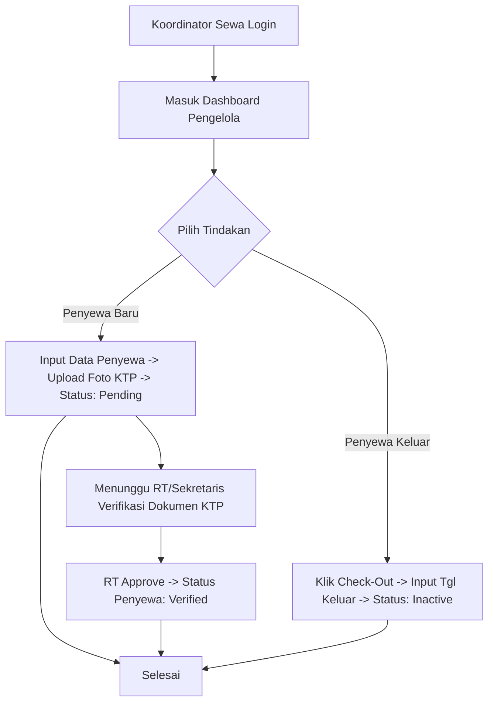
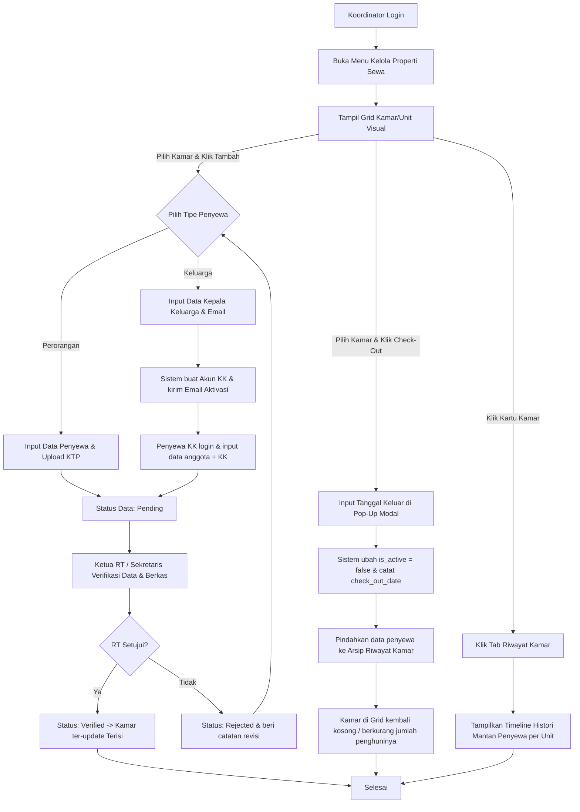

# Panduan Peran & Fitur: Koordinator Properti Sewa (Kos / Kontrakan)

Koordinator Properti Sewa (Penjaga Kos/Kontrakan / Caretaker) bertugas mengelola data penghuni sewa di lapangan (baik tipe perorangan maupun keluarga), mendaftarkan penghuni baru dengan dokumen KTP, serta menandai penghuni yang sudah keluar (check-out).

---

## 1. Navigasi & Struktur Menu (Sitemap)

Ketika Koordinator login, menu utama meliputi:
*   **Dashboard Utama:** Statistik ringkasan hunian aktif, kapasitas unit kosong, dan antrean verifikasi data penyewa baru.
    *   *(Catatan: Halaman ini hanya menjadi landing page/halaman utama bagi Koordinator Kasus C [penjaga luar/non-KK]. Bagi Warga Tetap yang merangkap Koordinator [Kasus A & B], landing page utama mereka setelah login tetaplah **Beranda Dashboard Warga** [untuk urusan keluarga pribadi], sedangkan statistik operasional kos di atas akan tampil saat mereka masuk ke halaman detail properti di menu **`Kelola Properti Pribadi`** / **`Kelola Properti Sewa`**).*
*   **Kelola Properti Sewa:** Menu utama berupa Grid Kamar/Unit visual untuk mengelola pintu/kamar yang ditugaskan.

### 1.1 Penyatuan Menu Dinamis & Hak Akses Properti (Owner vs Coordinator)
Hak akses dan susunan menu sidebar akan beradaptasi secara dinamis berdasarkan hubungan antara **Pemilik Aset (Owner)** dan **Pengelola Aset (Coordinator)**:

1.  **Kasus A: Pemilik Mengelola Asetnya Sendiri (Owner == Coordinator)**
    *   *Siapa*: Warga Tetap (Kepala Keluarga) yang memiliki kos/kontrakan dan menjaganya sendiri.
    *   *Menu Sidebar*: Menu Warga Biasa + **`Kelola Properti Pribadi`** (Sebagai Pemilik & Koordinator sekaligus).
    *   *Hak Akses*: Di dalam **Tab Kamar & Penghuni**, dia memiliki akses menulis penuh (**Check-In/Out** penyewa). Dia *tidak membutuhkan* menu "Kelola Properti Sewa" (menu penjaga) karena semua tugasnya sudah terintegrasi di bawah menu aset pribadinya.
2.  **Kasus B: Pemilik Menunjuk Warga Tetap Lain Sebagai Koordinator (Owner != Coordinator, Pengelola adalah KK lain)**
    *   **Di Sisi Pemilik**:
        *   *Menu Sidebar*: Menu Warga Biasa + **`Kelola Properti Pribadi`** (Sebagai Pemilik).
        *   *Hak Akses*: Dia bisa mendaftarkan properti baru, mengganti koordinator, dan melihat iuran bisnis. Namun, di **Tab Kamar & Penghuni**, dia hanya memiliki akses **Read-Only** (hanya memantau penyewa aktif, karena hak Check-In/Out sudah diserahkan ke penjaganya).
    *   **Di Sisi Koordinator (Penjaga)**:
        *   *Menu Sidebar*: Menu Warga Biasa + **`Kelola Properti Sewa`** (Sebagai Koordinator).
        *   *Hak Akses*: Dia tidak bisa mengakses menu "Kelola Properti Pribadi" (karena bukan pemilik aset). Dia hanya bisa mengelola **Check-In/Out** kamar untuk unit-unit yang didelegasikan kepadanya oleh Pemilik.
3.  **Kasus C: Pemilik Menunjuk Orang Luar/Anak Kos Sebagai Koordinator (Owner != Coordinator, Pengelola bukan KK)**
    *   *Siapa*: Penjaga kos bayaran atau anak kos tepercaya yang bukan merupakan warga tetap RT setempat (tidak terdaftar di KK lokal).
    *   *Menu Sidebar*: Hanya menampilkan **Dashboard Utama Koordinator** + **`Kelola Properti Sewa`** (Tanpa menu kependudukan warga seperti Kelola Keluarga ).
    *   *Hak Akses*: Akses menulis penuh (**Check-In/Out**) kamar yang didelegasikan. Tidak bisa mengakses menu "Kelola Properti Pribadi".

### 1.2 Konsep UI/UX Grid Kamar & Drawer Panel Geser (Slide-Over)
Untuk menyajikan tampilan yang sangat bersih, modern, dan rapi:
*   **Grid Kamar Visual:** Kartu kamar hanya menampilkan nomor kamar, warna status (Hijau = Kosong, Biru = Terisi, Oranye = Kongsi), dan nama penyewa. Tanpa ada tombol aksi langsung di dalam kartu.
*   **Drawer Panel Geser (Slide-Over):** Ketika kartu kamar di-klik, panel Drawer akan meluncur keluar dari sisi kanan layar. Di dalam Drawer inilah diletakkan 2 tab aksi:
    1.  **Tab Penghuni Aktif:**
        -   *Jika unit kosong:* Menampilkan tombol `[Check-In Penyewa]` untuk membuka form input penyewa.
        -   *Jika unit terisi:* Menampilkan biodata penyewa aktif beserta tombol merah **`[Check-Out]`** (untuk mengeluarkan penyewa).
    2.  **Tab Riwayat Kamar:** Menampilkan timeline runut waktu siapa saja mantan penyewa yang pernah tinggal di unit tersebut lengkap dengan periode tanggal check-in dan check-out.

---

## 2. Fitur & Tugas Utama

*   **KO-01: Registrasi Akun Koordinator & Properti Sewa Baru**
    *   **Jalur 1: Ditunjuk Langsung oleh Pemilik Properti Sewa:**
        *   Pemilik Kos/Kontrakan menunjuk pengelola melalui dashboard-nya.
        *   Jika pengelola yang ditunjuk belum memiliki akun login `users` (karena bukan Kepala Keluarga), Pemilik memasukkan **Email** pengelola tersebut. Nama & NIK ditarik otomatis dari database kependudukan warga.
        *   Akun dibuat otomatis berstatus `Pending`. Setelah Ketua RT menyetujui, akun menjadi `Active` dan link pembuatan password dikirim ke email pengelola untuk login pertama kali.
    *   **Jalur 2: Dibuatkan Langsung oleh Pengurus RT (Untuk Pemilik Properti yang Gaptek):**
        *   Ketua RT atau Sekretaris dapat mendaftarkan properti sewa dan membuatkan akun Koordinator secara manual melalui dashboard pengurus.
        *   Sistem langsung membuat akun berstatus `Active` dan data properti sewa terhubung. Kredensial default dikirimkan ke email pengelola.
    *   **Jalur 3: Pengesahan Akses & QR Code (Status Active):**
        *   Setelah RT menyetujui (Jalur 1) atau membuatkan langsung (Jalur 2), akun Koordinator aktif, properti sewa resmi terdaftar, dan `qr_token` di-generate otomatis oleh sistem backend.
        *   **Menu Akses Unduh QR Code:** Koordinator dapat melihat dan mengunduh berkas gambar QR Code properti sewa tersebut melalui **Menu: Kelola Properti Sewa** -> **Detail Properti** -> Klik Tombol **`[Unduh QR Code Properti]`**.
    *   **Alur Penonaktifan Koordinator (Copot Jabatan):**
        *   **Jika Koordinator adalah Warga Tetap (Kepala Keluarga):** Akun login tetap aktif (`status = 'active'`), namun perannya (*role*) diturunkan kembali menjadi **Warga biasa** sehingga menu "Kelola Properti Sewa" hilang dari dashboard-nya.
        *   **Jika Koordinator adalah Anak Kos / Orang Luar / bukan kepala keluarga:** Akun `users` diubah statusnya menjadi **`suspended`** (non-aktif) secara otomatis agar ia tidak bisa login lagi untuk mengintip data, karena ia tidak memiliki relasi keluarga (`families`) di wilayah RT tersebut.
*   **KO-02: Kelola Penghuni Properti Sewa (Sistem Terpadu)**
    Setiap menginput data penghuni baru di unit/kamar, Koordinator memilih **Tipe Penghuni** (berlaku sama baik untuk kos maupun kontrakan):
    *   **Kasus A: Tipe Sewa Perorangan (Anak Kos / Kontrakan Kolektif):**
        Menginput data penyewa secara lengkap:
        *   `Nama Lengkap Penyewa` (Sesuai KTP)
        *   `NIK Penyewa` (16 digit angka, unik)
        *   `Nomor WhatsApp / HP`
        *   `Alamat Asal` (Alamat daerah asal sesuai KTP)
        *   `Nomor Kamar / Pintu` (misal: *Kamar 102*, *Pintu 02*)
        *   `Tanggal Masuk` & `Berkas Scan KTP`
    *   **Kasus B: Tipe Sewa Keluarga (Kontrakan Keluarga / Kos Pasutri - Alur Delegasi):**
        Koordinator **cukup menginput data minimal Kepala Keluarga** penyewa unit tersebut:
        *   `Nama Kepala Keluarga` (Sesuai KTP)
        *   `NIK Kepala Keluarga` (16 digit angka, unik)
        *   `Nomor WhatsApp / HP Kepala Keluarga`
        *   `Email Kepala Keluarga` (Wajib, untuk pengiriman link aktivasi akun)
        *   `Nomor Pintu / Unit` (misal: *Pintu 03*)
        *   `Tanggal Masuk (Check-In)`
        *   *Alur Delegasi & Kunci Akses:* Setelah disimpan, sistem otomatis mengirimkan link aktivasi ke **Email** Kepala Keluarga tersebut. Kepala Keluarga penyewa tinggal membuat password melalui link tersebut, login, dan menginput berkas KK serta data anggota keluarganya secara mandiri. Selama berkas KK dan data kependudukan tersebut belum diverifikasi oleh RT (status masih `Pending`), menu dashboard lainnya **terkunci/tidak aktif**. Setelah disetujui (status: `Verified`) oleh RT, barulah kunci dashboard terbuka sepenuhnya dan data mereka dinyatakan sah terdaftar sebagai warga di RT setempat.
    *   Memantau status verifikasi seluruh data penghuni dari RT (Pending / Verified / Rejected).
*   **KO-03: Manajemen Check-Out**
    Menandai penghuni sewa yang sudah pindah/keluar dengan memasukkan tanggal keluar. Data penghuni tersebut otomatis dinonaktifkan (`is_active = false`) agar tertib administrasi.
*   **KO-04: Pelacakan Riwayat Penyewa Per Unit/Kamar**
    Melihat histori siapa saja mantan penghuni yang pernah menyewa unit/kamar tertentu lengkap dengan rentang **Bulan dan Tahun** tinggal.

---

## 3. Alur Kerja Utama (Flowchart)

---

## 4. Alur Kerja Detail (User Flow - Siklus Hidup Penyewa)

Berikut adalah detail langkah-langkah alur kerja (User Flow) dalam pengelolaan penyewa, mulai dari penambahan (check-in), proses keluar (check-out), hingga pelacakan riwayat tinggal kamar.

### 4.1 Deskripsi Alur Kerja

#### A. Alur Penambahan Penyewa Baru (Check-In)
1.  **Akses Grid Properti:** Koordinator masuk ke **Menu: Kelola Properti Sewa** (jika mengelola lebih dari 1 properti, sistem menampilkan daftar kartu properti terlebih dahulu untuk dipilih, baru menampilkan denah **Grid Kamar/Unit** properti terpilih).
2.  **Klik Unit:** Koordinator meng-klik tombol **`[+ Isi Kamar]`** (pada kamar kosong) atau **`[+ Tambah]`** (pada kamar kongsi/room sharing).
3.  **Pengisian Form:**
    -   Sistem membuka form dengan nomor kamar terisi otomatis secara *read-only*.
    -   Koordinator memilih **Tipe Penyewa**:
        -   **Sewa Perorangan:** Koordinator menginput data lengkap (Nama, NIK, No HP, Asal, Tgl Masuk) dan mengunggah berkas KTP penyewa $\rightarrow$ Klik Simpan $\rightarrow$ Status data: `Pending`.
        -   **Sewa Keluarga (Delegasi):** Koordinator menginput data minimal Kepala Keluarga (Nama, NIK, No HP, Email, Tgl Masuk) $\rightarrow$ Klik Simpan. Sistem otomatis membuat akun KK penyewa dan mengirim email aktivasi link password. Kepala Keluarga login, melengkapi data anggota keluarga, dan mengunggah KK $\rightarrow$ Klik Simpan $\rightarrow$ Status data: `Pending`.
4.  **Verifikasi RT:** Ketua RT / Sekretaris memverifikasi berkas KTP/KK.
    -   *Disetujui (Verified):* Status data menjadi `Verified`. Kunci akses dashboard penyewa terbuka (jika tipe keluarga). Kartu unit di Grid Kamar diperbarui (warna berubah terisi).
    -   *Ditolak (Rejected):* Status data menjadi `Rejected` beserta alasan. Koordinator/Penyewa harus memperbaiki data/berkas.

#### B. Alur Penyewa Pergi (Check-Out)
1.  **Klik Check-Out:** Pada **Grid Kamar**, Koordinator memilih unit, lalu meng-klik tombol **`[Check-Out]`** pada nama penyewa spesifik yang akan keluar.
2.  **Input Tanggal Keluar:** Muncul pop-up modal, Koordinator menginput tanggal keluar (Check-Out Date) dan alasan (opsional) $\rightarrow$ Klik Simpan.
3.  **Pembaruan Status & Arsip Otomatis:**
    -   Sistem mengubah status keaktifan penyewa tersebut menjadi non-aktif (`is_active = false`).
    -   Sistem mencatat tanggal keluar ke database.
    -   Data penyewa dipindahkan secara otomatis dari daftar penghuni aktif ke **Arsip Riwayat Kamar**.
    -   Jika kamar tersebut tidak memiliki penyewa kongsi aktif lain, warna kartu kamar pada Grid kembali berubah menjadi Hijau (Kosong).

#### C. Alur Pelacakan Riwayat Tinggal Kamar (History)
1.  **Detail Kamar:** Pada **Grid Kamar**, Koordinator atau Pemilik meng-klik kartu unit/kamar tertentu (misal: Kamar 102).
2.  **Buka Tab Riwayat:** Pengguna meng-klik tab **`[Riwayat Kamar]`** di panel detail kamar.
3.  **Tampilan Histori:** Sistem menampilkan daftar runut waktu (timeline) siapa saja mantan penyewa yang pernah tinggal di kamar tersebut, lengkap dengan informasi:
    -   Nama Penyewa (perorangan / KK)
    -   Periode Tinggal (Bulan/Tahun Masuk s.d. Bulan/Tahun Keluar)
    -   Status Akhir (Pindah)

---

### 4.2 Diagram Alur Kerja (Mermaid Flowchart)

