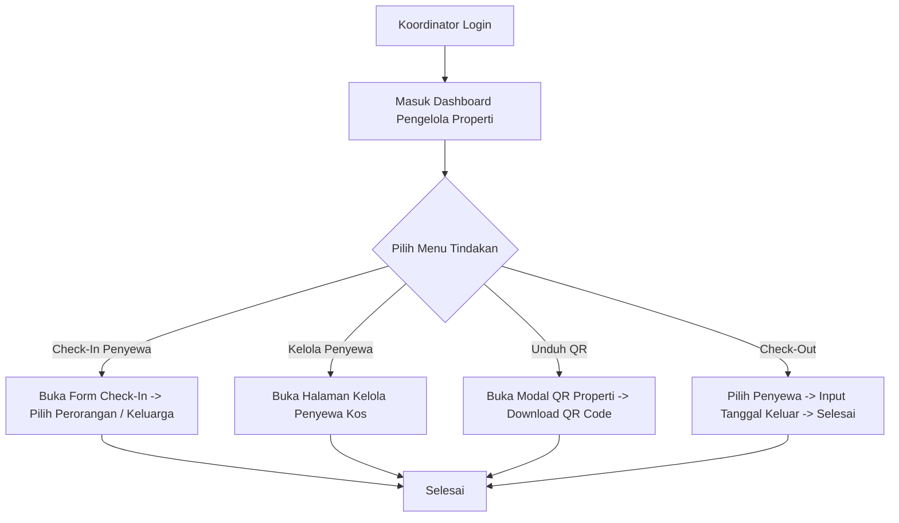
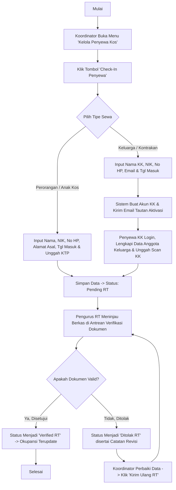
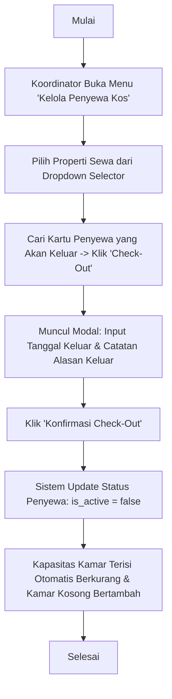
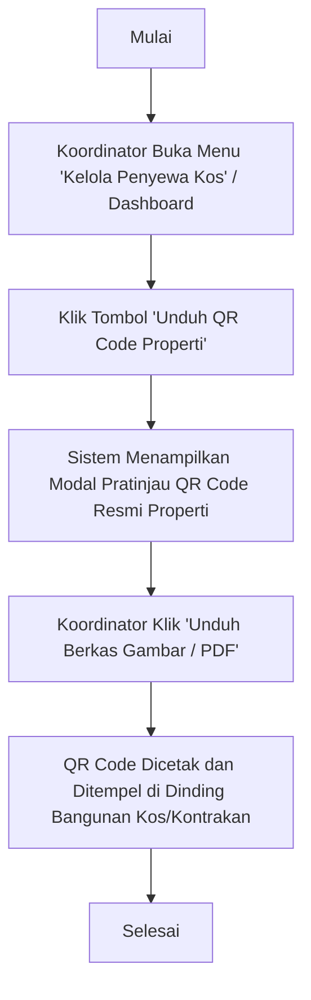

# Panduan Peran & Fitur: Koordinator Properti Sewa (Kos / Kontrakan)

Koordinator Properti Sewa (Penjaga Kos/Kontrakan / Caretaker) bertugas mengelola data penghuni sewa di lapangan (tipe perorangan maupun keluarga), mendaftarkan penyewa baru dengan dokumen KTP, mengunduh QR code properti, serta memproses check-out penyewa yang keluar.

---

## 1. Navigasi & Struktur Menu (Sitemap)

Ketika Koordinator login ke sistem, menu navigasi sidebar meliputi:

*   **Dashboard:** Ringkasan metrik keterisian kamar kos/kontrakan, sisa unit kosong, antrean verifikasi berkas RT, kartu aksi cepat, dan progres okupansi per properti (`/dashboard`).
*   **Kelola Penyewa Kos:** Panel utama pengelolaan properti sewa, pengubahan cepat kapasitas kamar, pencetakan QR code properti, pendaftaran *check-in*, pengeditan data, pengajuan ulang berkas, dan pemrosesan *check-out* penyewa (`/dashboard/rentals`).

---

## 2. Fitur & Tugas Utama

*   **KO-01: Dashboard Pengelola Properti Sewa (`/dashboard`)**
    Menyajikan gambaran operasional tempat sewa secara real-time:
    *   **A. 4 KPI Cards Ringkasan Operasional:**
        *   `Properti Sewa`: Jumlah total lokasi kos/kontrakan yang dikelola dan total kapasitas kamar keseluruhan.
        *   `Terisi & Okupansi`: Jumlah kamar terisi, persentase okupansi aktif, dan total jiwa penghuni yang terdaftar.
        *   `Kamar Kosong`: Jumlah unit/kamar yang siap huni (*vacant rooms*).
        *   `Pending RT`: Jumlah data penyewa baru yang sedang menunggu verifikasi dokumen dari pengurus RT.
    *   **B. Akses Cepat Pengelola (Coordinator Quick Actions):**
        *   Tombol pintas untuk langsung membuka formulir *Check-In Penyewa*, modul *Kelola Unit & Kamar*, atau modal *Unduh QR Code Properti*.
    *   **C. Okupansi Properti Sewa yang Dikelola (`PropertyOccupancySection`):**
        *   Daftar kartu tempat kos/kontrakan dengan diagram batang persentase okupansi, status ketersediaan (*Penuh / X Kamar Kosong*), serta rincian kamar terisi vs kosong.
    *   **D. Antrean Verifikasi Dokumen Penyewa (`PendingVerificationQueue`):**
        *   Tabel pemantauan berkas penyewa baru yang telah didaftarkan dan sedang menunggu persetujuan pengurus RT.

*   **KO-02: Manajemen Properti Sewa & Keterisian Kamar (`/dashboard/rentals`)**
    *   **Selector Properti:** Pemilihan properti aktif bagi Koordinator yang mengelola lebih dari 1 lokasi kos/kontrakan.
    *   **Pengaturan Cepat Keterisian Kamar (Quick Capacity Edit):** Penyesuaian instan jumlah total kapasitas kamar dan jumlah kamar terisi tanpa perlu membuka formulir yang rumit. Sistem secara otomatis menghitung sisa kamar kosong.
    *   **Unduh QR Code Properti Sewa (`PropertyQrModal`):** Pratinjau dan pengunduhan QR Code nomor hunian sewa fisik untuk dipasang di dinding bangunan kos/kontrakan.

*   **KO-03: Pendaftaran Penghuni Sewa Baru (Check-In Management)**
    Mendaftarkan penyewa baru ke dalam sistem dengan memilih **Tipe Sewa**:
    *   **Kasus A: Sewa Perorangan (Anak Kos / Kontrakan Perorangan):**
        Koordinator menginput data identitas lengkap penyewa:
        *   `Nama Lengkap Penyewa` (sesuai KTP)
        *   `NIK Penyewa` (16 digit angka, unik)
        *   `Nomor WhatsApp / HP`
        *   `Alamat Asal` (alamat daerah asal sesuai KTP)
        *   `Tanggal Masuk (Check-In Date)`
        *   `Unggah Scan / Foto KTP`
        *   Data tersimpan dengan status `Pending RT` menunggu verifikasi pengurus RT.
    *   **Kasus B: Sewa Keluarga (Kontrakan Keluarga / Kos Pasutri - Alur Delegasi):**
        Koordinator menginput data dasar Kepala Keluarga:
        *   `Nama Kepala Keluarga` (sesuai KTP)
        *   `NIK Kepala Keluarga` (16 digit angka, unik)
        *   `Nomor WhatsApp / HP`
        *   `Email Kepala Keluarga` (Wajib, untuk pengiriman tautan aktivasi akun)
        *   `Tanggal Masuk (Check-In Date)`
        *   *Alur Delegasi Aktivasi:* Sistem otomatis membuatkan akun dan mengirimkan tautan aktivasi ke email Kepala Keluarga tersebut. Kepala Keluarga membuat kata sandi, login, dan melengkapi data anggota keluarga serta scan KK secara mandiri.

*   **KO-04: Pengelolaan Kontrak & Penyewa Aktif (`ActiveTenantsTab`)**
    *   **Pratinjau Berkas KTP:** Tautan penampil berkas aman (*SecureDocumentLink*) untuk melihat foto KTP penyewa.
    *   **Kirim Ulang Aktivasi Akun:** Tombol kirim ulang email aktivasi bagi penyewa tipe keluarga yang belum mengaktifkan akunnya.
    *   **Edit Biodata Penyewa:** Memperbarui data kontak, nama, dan detail sewa penyewa.
    *   **Kirim Ulang Verifikasi RT:** Mengajukan kembali berkas penyewa yang sebelumnya ditolak RT setelah koordinator/penyewa memperbaiki data/berkas.
    *   **Hapus Kontrak Sewa:** Menghapus data kontrak sewa yang salah atau dibatalkan.

*   **KO-05: Manajemen Check-Out (Penyewa Keluar)**
    *   Menandai penyewa yang telah selesai masa sewanya atau pindah dengan menginput **Tanggal Keluar (Check-Out Date)** dan catatan opsional.
    *   Sistem otomatis menonaktifkan status keaktifan penyewa (`is_active = false`) dan memperbarui perhitungan okupansi kamar.

---

## 3. Alur Kerja Utama (Flowchart)

---

## 4. Alur Kerja Detail (User Flow)

### 4.1 Flow Pendaftaran Penyewa Baru (Check-In)

### 4.2 Flow Penyewa Keluar (Check-Out)

### 4.3 Flow Unduh QR Code Properti Sewa

