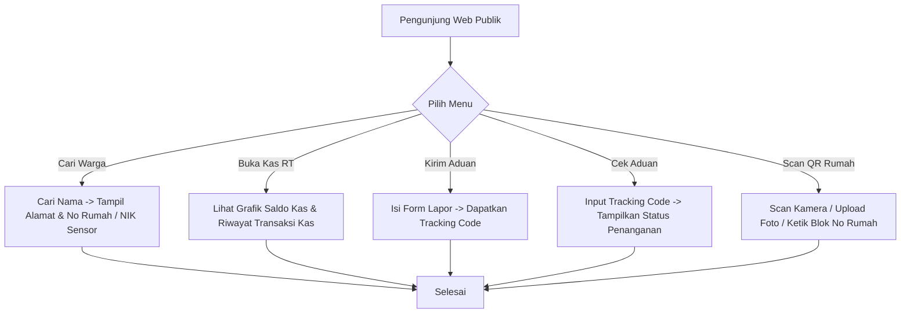
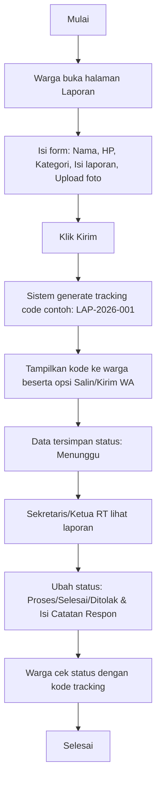
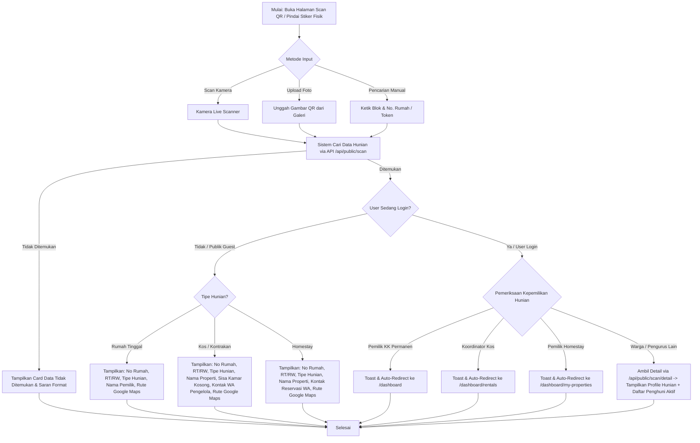

# Panduan Halaman Publik & Tamu (Tanpa Login)

Halaman Publik dapat diakses oleh siapa saja tanpa perlu masuk (login) ke dalam sistem. Modul ini difokuskan untuk keterbukaan informasi keuangan, portal pengumuman warga, pengajuan aduan, dan informasi QR Code rumah.

---

## 1. Peta Halaman Publik (Sitemap)

Pengunjung yang membuka domain utama web RT akan menemui navigasi publik:
*   **Beranda (Homepage):** Halaman utama yang menampilkan ringkasan pengumuman terbaru/penting, jadwal terdekat, daftar kontak darurat, serta dashboard Statistik & Demografi Kependudukan Agregat di bagian bawah.
*   **Semua Pengumuman:** (Halaman Khusus) Arsip lengkap seluruh pengumuman warga dengan fitur pencarian dan kategori.
*   **Semua Jadwal Kegiatan:** (Halaman Khusus) Kalender dan daftar lengkap seluruh jadwal kegiatan/agenda RT.
*   **Transparansi Kas:** (Menu Utama) Laporan grafik arus kas masuk/keluar & tabel rincian transaksi kas bulanan secara terbuka.
*   **Portal Pengaduan:** (Menu Utama)
    *   **Lapor Warga:** (Sub-menu / Dropdown) Formulir pengiriman laporan pengaduan publik dengan nomor HP aktif & upload foto (anti-spam).
    *   **Cek Status Aduan:** (Sub-menu / Dropdown) Halaman tracking pelacakan laporan menggunakan Kode Tracking unik.
*   **Scan QR Code Hunian:** (Menu Utama) Akses pemindaian stiker QR fisik (kamera live / upload foto) atau pencarian manual Blok & Nomor Rumah untuk deteksi status alamat, tipe hunian, ketersediaan kamar sewaan, kontak pengelola, serta rute Google Maps tanpa login.

---

## 2. Fitur & Tugas Utama

*   **PB-01: Portal Informasi RT (Dashboard Publik)**
    *   **Beranda Utama (Homepage Layout):**
        1.  **Bagian Atas:** Ringkasan 3-5 Pengumuman Terbaru/Penting dan 3-5 Jadwal Kegiatan RT terdekat yang disajikan dalam bentuk card interaktif, lengkap dengan tautan/tombol untuk membuka halaman arsip lengkap masing-masing.
        2.  **Bagian Tengah:** Daftar Kontak Darurat Lokal yang dapat dihubungi dengan cepat (Pos Ronda, Ambulans, Damkar, Bhabinkamtibmas/Polsek).
        3.  **Bagian Bawah:** Statistik & Demografi Kependudukan Agregat secara informatif.
    *   **Statistik & Demografi Kependudukan Agregat** (Tanpa data individu sensitif untuk menjaga privasi):
        *   **Total Warga Aktif:** Jumlah total gabungan warga tetap dan penghuni sewa yang berstatus aktif.
        *   **Total Kepala Keluarga (KK):** Jumlah KK terdaftar di wilayah RT.
        *   **Demografi/Sebaran Usia:** Grafik pembagian kelompok usia (Balita: 0-5 th, Anak: 6-12 th, Remaja: 13-18 th, Dewasa/Produktif: 19-59 th, Lansia: >=60 th).
        *   **Sebaran Pekerjaan Warga:** Persentase jenis pekerjaan warga (contoh: PNS, Karyawan Swasta, Wiraswasta, Pelajar/Mahasiswa, Tidak Bekerja, dll.).
        *   **Sebaran Pendidikan:** Persentase tingkat pendidikan terakhir warga (Belum Sekolah, SD, SMP, SMA, Diploma, S1, S2/S3).
        *   **Status Hunian Properti:** Rasio hunian rumah (Terisi Keluarga Tetap, Rumah Kos/Kontrakan Aktif, Hunian Kosong).
        *   **Rasio Gender:** Grafik perbandingan jumlah Laki-laki vs Perempuan di wilayah RT.
        *   **Statistik Pengaduan Warga:** Grafik akumulasi status penanganan laporan (Menunggu, Proses, Selesai, Ditolak) serta grafik sebaran jumlah aduan berdasarkan kategori/tipe (laporan yang di tolak tidak dihitung) (Infrastruktur, eKbersihan, Keamanan, Sosial, Lainnya).
    *   **Daftar Kontak Darurat Lokal:** Akses cepat nomor darurat penting di beranda publik (Pos Ronda RT, Ambulans/Puskesmas terdekat, Pemadam Kebakaran, Polisi/Babinsa setempat).
*   **PB-02: Transparansi Arus Kas**
    Warga umum dapat melihat grafik statistik pemasukan vs pengeluaran per bulan serta tabel detail rincian transaksi kas terbaru secara *read-only*.
*   **PB-03: Pengaduan Tanpa Login & Tracking (Anti-Spam)**
    *   Warga/tamu dapat mengirim laporan masalah (kebersihan, ketertiban, infrastruktur rusak) dengan mengisi form aduan, wajib melampirkan nomor HP aktif, dan mengunggah foto bukti.
    *   **Perlindungan Spam:** Form dilindungi oleh **Cloudflare Turnstile** (CAPTCHA gratis & tidak mengganggu) serta **Rate Limiting** (maksimal 2 laporan per IP per jam) untuk mencegah spamming bot/manual.
    *   Setelah dikirim, sistem memberikan **Tracking Code** unik (contoh: `LAP-2026-001`) dan menyediakan tombol **"Salin Info Pengaduan"** atau **"Simpan ke WhatsApp"** (membuka wa.me dengan teks otomatis) agar warga mudah menyimpan kode tersebut secara mandiri.
    *   Pengirim dapat menginput kode tersebut di halaman "Cek Aduan" untuk melihat status penanganan: `Menunggu`, `Proses`, `Selesai`, atau **`Ditolak`**. Demi privasi keamanan pelapor, status laporan **hanya bisa dilacak menggunakan Tracking Code ini** (tidak bisa dicari menggunakan nama/nomor HP secara publik untuk menghindari pengintipan oleh tetangga).
    *   Jika laporan tidak valid, iseng, atau tidak jelas, pengurus akan mengubah status menjadi **`Ditolak`** dan memberikan **Catatan Tanggapan/Alasan Penolakan** yang dapat dibaca oleh pelapor secara terbuka melalui halaman tracking.
    *   Tampilannya hanya berupa form pengajuan laporan and setelah melapor ada opsi copy kode tracking dan kirim code ke WA pelapor serta ada peringatan untuk menyimpan code jika ingin melacak aduan.
*   **PB-04: Info Dasar QR Code Rumah (Smart QR)**
    Mendukung pemindaian stiker QR Code fisik di dinding rumah warga, unggah foto QR, atau pencarian manual nomor rumah dengan tampilan kondisional per tipe hunian dan penyesuaian hak akses (Publik vs Warga Login):
    *   **Metode Pemindaian & Pencarian Multi-mode:**
        1.  **Scan Kamera Live:** Memindai stiker QR Code secara langsung via kamera perangkat (`qr-scanner` dengan otomatisasi memilih kamera belakang dan selector pemilihan kamera jika >1).
        2.  **Upload Foto QR Code:** Mengunggah file gambar foto QR Code dari galeri perangkat.
        3.  **Pencarian Manual Nomor Rumah:** Formulir pencarian manual dengan kata kunci Blok & Nomor Rumah (contoh: `A1-12`, `Blok A1 No. 12`) atau Kode Token QR (`qr-dwelling-xxx`).
    *   **Informasi Standar Semua Hunian:** Menampilkan Nomor Rumah, RT/RW, Desa/Kelurahan, Tipe Hunian, serta Koordinat GPS & Tombol Rute Google Maps (`📍 Petunjuk Rute Google Maps`).
    *   **Aturan Detail Tampilan Per Tipe Hunian (Mode Publik):**
        *   **Rumah Tinggal Pribadi (`permanen`):** Menampilkan data alamat, RT/RW, tipe hunian, dan Nama Pemilik / Kepala Keluarga.
        *   **Kos-kosan / Kontrakan (`kos`):** Menampilkan Nama Properti Kos (contoh: "Kos Melati"), Ketersediaan Kamar Kosong (dihitung otomatis: `total_rooms` dikurangi penyewa aktif), rincian terisi & total kamar, serta Nama Pengelola & Tombol Pesan WhatsApp langsung (`wa.me` otomatis).
        *   **Homestay (Sewa Harian) (`homestay`):** Menampilkan Nama Homestay (contoh: "Villa Indah") dan Kontak Pengelola/Reservasi via WhatsApp. **Tidak menampilkan** sisa kamar kosong karena sirkulasi sewa harian tidak terdata di sistem kependudukan.
    *   **Mode Pengunjung Publik / Tamu (Tanpa Akun / Belum Login):**
        *   Pengunjung umum/tamu yang tidak memiliki akun atau belum masuk (login) ke sistem akan menerima tampilan **Mode Publik**.
        *   **Perlindungan Privasi Warga:** Rincian data sensitif perorangan (seperti daftar nama anggota keluarga, NIK, atau daftar nama penyewa kamar) **TIDAK ditampilkan** kepada publik.
        *   **Informasi yang Dapat Diakses Tamu Publik:**
            1.  **Status Alamat & Hunian:** Nomor Rumah, RT/RW, Desa/Kelurahan, & Tipe Hunian.
            2.  **Informasi Komersial & Kontak Sewa:** Sisa kamar kosong (khusus Kos) & Tombol Kontak Pengelola via WhatsApp (`wa.me`) untuk reservasi/tanya jawab sewa (Kos & Homestay).
            3.  **Navigasi Lokasi GPS:** Koordinat lokasi terdaftar & tombol langsung petunjuk rute Google Maps (`📍 Petunjuk Rute Google Maps`).
    *   **Pemeriksaan Kepemilikan & Auto-Redirect (Post-Scan Check):**
        *   Jika pengunjung **sedang login** dan merupakan pemilik/koordinator dari hunian yang di-scan:
            *   *Warga Permanen (Kepala KK):* Dialihkan (redirect) otomatis ke Dashboard Warga (`/dashboard`).
            *   *Koordinator Kos:* Dialihkan otomatis ke Halaman Kelola Kamar Kos (`/dashboard/rentals?propertyId=...`).
            *   *Pemilik Homestay:* Dialihkan otomatis ke Halaman Kelola Homestay (`/dashboard/my-properties?dwellingId=...`).
    *   **Mode Tampilan Warga Login (Non-Pemilik):**
        *   Jika pengunjung **sedang login** sebagai warga/pengurus (tetapi bukan pemilik hunian tersebut), sistem menampilkan banner mode login, **Daftar Penghuni Aktif** (Nama KK & Jumlah Anggota untuk Keluarga; atau Nama Penyewa, Nomor Kamar, & Tanggal Masuk untuk Kos), serta tombol "Ke Dashboard Saya".
    *   **Penanganan State Error / Not Found (`DwellingNotFoundState`):**
        *   Jika token atau nomor rumah tidak ditemukan dalam database, sistem menampilkan kartu state *Friendly Not Found* lengkap dengan saran format pencarian yang benar, tombol *Coba Ulangi Pencarian*, dan navigasi *Kembali ke Beranda*.

---

## 3. Alur Kerja Utama (Flowchart)

---

## 4. Alur Kerja Detail (User Flow)

### 4.1 Flow Laporan Warga (Tanpa Login)

### 4.2 Flow Scan QR Code Rumah

