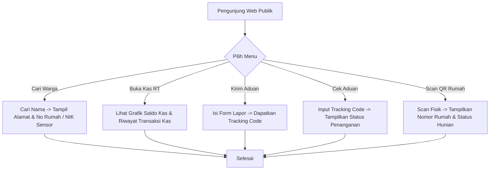
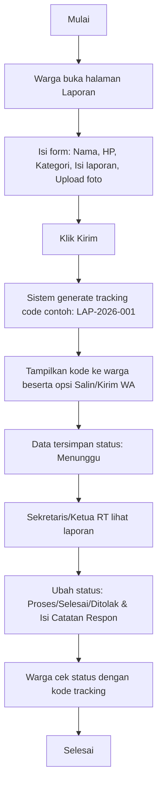

# Panduan Halaman Publik & Tamu (Tanpa Login)

Halaman Publik dapat diakses oleh siapa saja tanpa perlu masuk (login) ke dalam sistem. Modul ini difokuskan untuk keterbukaan informasi keuangan, portal pengumuman warga, pengajuan aduan, dan informasi QR Code rumah.

---

## 1. Peta Halaman Publik (Sitemap)

Pengunjung yang membuka domain utama web RT akan menemui navigasi publik:
*   **Beranda (Homepage):** Halaman utama yang menampilkan ringkasan pengumuman terbaru/penting, jadwal terdekat, daftar kontak darurat, serta dashboard Statistik & Demografi Kependudukan Agregat di bagian bawah.
*   **Semua Pengumuman:** (Halaman Khusus) Arsip lengkap seluruh pengumuman warga dengan fitur pencarian dan kategori.
*   **Semua Jadwal Kegiatan:** (Halaman Khusus) Kalender dan daftar lengkap seluruh jadwal kegiatan/agenda RT.
*   **Transparansi Kas:** (Menu Utama) Laporan grafik arus kas masuk/keluar & tabel rincian transaksi kas bulanan secara terbuka.
*   **Portal Pengaduan:** (Menu Utama)
    *   **Lapor Warga:** (Sub-menu / Dropdown) Formulir pengiriman laporan pengaduan publik dengan nomor HP aktif & upload foto (anti-spam).
    *   **Cek Status Aduan:** (Sub-menu / Dropdown) Halaman tracking pelacakan laporan menggunakan Kode Tracking unik.
*   **Scan QR Code Hunian:** (Menu Utama) Akses instan deteksi status alamat rumah, tipe hunian, & detail kontak komersial sewaan (kos/kontrakan/homestay) tanpa login.

---

## 2. Fitur & Tugas Utama

*   **PB-01: Portal Informasi RT (Dashboard Publik)**
    *   **Beranda Utama (Homepage Layout):**
        1.  **Bagian Atas:** Ringkasan 3-5 Pengumuman Terbaru/Penting dan 3-5 Jadwal Kegiatan RT terdekat yang disajikan dalam bentuk card interaktif, lengkap dengan tautan/tombol untuk membuka halaman arsip lengkap masing-masing.
        2.  **Bagian Tengah:** Daftar Kontak Darurat Lokal yang dapat dihubungi dengan cepat (Pos Ronda, Ambulans, Damkar, Bhabinkamtibmas/Polsek).
        3.  **Bagian Bawah:** Statistik & Demografi Kependudukan Agregat secara informatif.
    *   **Statistik & Demografi Kependudukan Agregat** (Tanpa data individu sensitif untuk menjaga privasi):
        *   **Total Warga Aktif:** Jumlah total gabungan warga tetap dan penghuni sewa yang berstatus aktif.
        *   **Total Kepala Keluarga (KK):** Jumlah KK terdaftar di wilayah RT.
        *   **Demografi/Sebaran Usia:** Grafik pembagian kelompok usia (Balita: 0-5 th, Anak: 6-12 th, Remaja: 13-18 th, Dewasa/Produktif: 19-59 th, Lansia: >=60 th).
        *   **Sebaran Pekerjaan Warga:** Persentase jenis pekerjaan warga (contoh: PNS, Karyawan Swasta, Wiraswasta, Pelajar/Mahasiswa, Tidak Bekerja, dll.).
        *   **Sebaran Pendidikan:** Persentase tingkat pendidikan terakhir warga (Belum Sekolah, SD, SMP, SMA, Diploma, S1, S2/S3).
        *   **Status Hunian Properti:** Rasio hunian rumah (Terisi Keluarga Tetap, Rumah Kos/Kontrakan Aktif, Hunian Kosong).
        *   **Rasio Gender:** Grafik perbandingan jumlah Laki-laki vs Perempuan di wilayah RT.
        *   **Statistik Pengaduan Warga:** Grafik akumulasi status penanganan laporan (Menunggu, Proses, Selesai, Ditolak) serta grafik sebaran jumlah aduan berdasarkan kategori/tipe (laporan yang di tolak tidak dihitung) (Infrastruktur, eKbersihan, Keamanan, Sosial, Lainnya).
    *   **Daftar Kontak Darurat Lokal:** Akses cepat nomor darurat penting di beranda publik (Pos Ronda RT, Ambulans/Puskesmas terdekat, Pemadam Kebakaran, Polisi/Babinsa setempat).
*   **PB-02: Transparansi Arus Kas**
    Warga umum dapat melihat grafik statistik pemasukan vs pengeluaran per bulan serta tabel detail rincian transaksi kas terbaru secara *read-only*.
*   **PB-03: Pengaduan Tanpa Login & Tracking (Anti-Spam)**
    *   Warga/tamu dapat mengirim laporan masalah (kebersihan, ketertiban, infrastruktur rusak) dengan mengisi form aduan, wajib melampirkan nomor HP aktif, dan mengunggah foto bukti.
    *   **Perlindungan Spam:** Form dilindungi oleh **Cloudflare Turnstile** (CAPTCHA gratis & tidak mengganggu) serta **Rate Limiting** (maksimal 2 laporan per IP per jam) untuk mencegah spamming bot/manual.
    *   Setelah dikirim, sistem memberikan **Tracking Code** unik (contoh: `LAP-2026-001`) dan menyediakan tombol **"Salin Info Pengaduan"** atau **"Simpan ke WhatsApp"** (membuka wa.me dengan teks otomatis) agar warga mudah menyimpan kode tersebut secara mandiri.
    *   Pengirim dapat menginput kode tersebut di halaman "Cek Aduan" untuk melihat status penanganan: `Menunggu`, `Proses`, `Selesai`, atau **`Ditolak`**. Demi privasi keamanan pelapor, status laporan **hanya bisa dilacak menggunakan Tracking Code ini** (tidak bisa dicari menggunakan nama/nomor HP secara publik untuk menghindari pengintipan oleh tetangga).
    *   Jika laporan tidak valid, iseng, atau tidak jelas, pengurus akan mengubah status menjadi **`Ditolak`** dan memberikan **Catatan Tanggapan/Alasan Penolakan** yang dapat dibaca oleh pelapor secara terbuka melalui halaman tracking.
    *   Tampilannya hanya berupa form pengajuan laporan and setelah melapor ada opsi copy kode tracking dan kirim code ke WA pelapor serta ada peringatan untuk menyimpan code jika ingin melacak aduan.
*   **PB-04: Info Dasar QR Code Rumah (Smart QR)**
    Mendukung tampilan informasi kondisional berdasarkan **Tipe Hunian** saat memindai QR Code fisik di dinding rumah warga:
    *   **Semua Tipe Hunian:** Halaman hasil scan publik akan selalu menampilkan **Nomor Rumah**, **RT/RW**, dan **Tipe Hunian**.
    *   **Aturan Detail Per Tipe Hunian:**
        *   **Rumah Tinggal Pribadi:** Hanya menampilkan data alamat & tipe hunian dan nama pemilik.
        *   **Kos-kosan / Kontrakan:** Menampilkan tambahan berupa **Nama Properti** (misal: "Kos Melati"), **Sisa Kamar Kosong** (dihitung otomatis: `total_rooms` dikurangi penyewa aktif) dan **Kontak Pengelola** (Nama & tombol WhatsApp) untuk memudahkan promosi sewa.
        *   **Homestay (Sewa Harian):** Menampilkan tambahan berupa **Nama Properti** (misal: "Villa Indah") dan **Kontak Pengelola** (Nama & tombol WhatsApp) saja untuk reservasi harian. **TIDAK menampilkan** sisa kamar kosong karena sirkulasi harian tidak terdata di aplikasi kependudukan.

---

## 3. Alur Kerja Utama (Flowchart)



---

## 4. Alur Kerja Detail (User Flow)

### 4.1 Flow Laporan Warga (Tanpa Login)



### 4.2 Flow Scan QR Code Rumah

```mermaid
flowchart TD
    C -->|Tidak / Publik| D{Tipe Hunian?}
    D -->|Rumah Tinggal| D1[Tampilkan: No Rumah, RT/RW & Tipe Hunian<br>- Tautan Lapor Pengaduan]
    D -->|Kos / Kontrakan| D2[Tampilkan: No Rumah, RT/RW & Tipe Hunian<br>- Nama Properti<br>- Sisa Kamar Kosong<br>- Kontak Pengelola WA]
    D -->|Homestay| D3[Tampilkan: No Rumah, RT/RW & Tipe Hunian<br>- Nama Properti<br>- Kontak Pengelola WA<br><i>(Tanpa Kamar Kosong)</i>]
    C -->|Ya / Warga atau Pengurus| E[Tampilkan Detail Hunian per Pintu/Kamar:<br>- Nama Pemilik & Kontak<br>- Daftar Penghuni Aktif<br>  * KK: Nama KK + Jml Anggota<br>  * Mandiri: Nama (Tinggal Sendiri)<br>  * Penyewa: Nama Penyewa + No Kamar/Pintu<br>- Riwayat Penghuni Terdahulu<br>  * Periode: Bulan & Tahun Masuk/Keluar]
    
    D1 --> F[Selesai]
    D2 --> F
    D3 --> F
    E --> F
```
