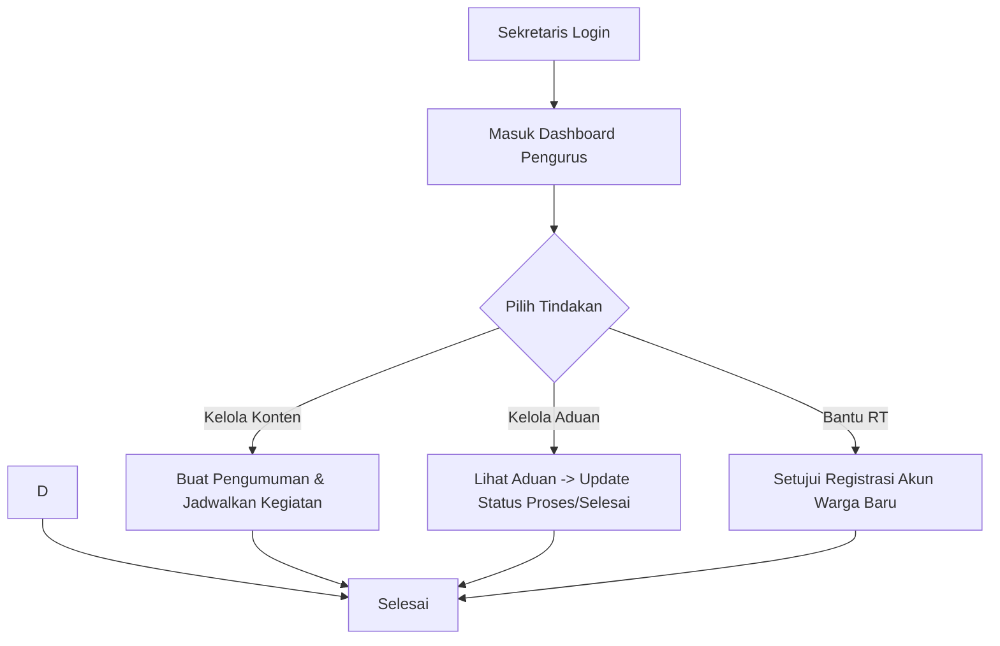
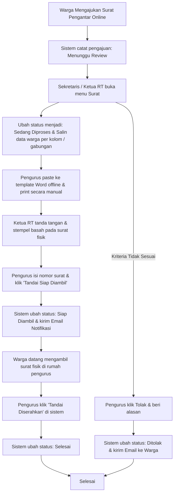

# Panduan Peran & Fitur: Sekretaris

Sekretaris adalah pelaksana administrasi utama RT yang bertugas menyusun pengumuman, agenda kegiatan, pengaduan warga, serta membantu Ketua RT dalam verifikasi kependudukan.

---

## 1. Navigasi & Struktur Menu (Sitemap)

Ketika Sekretaris login, menu sidebar utama meliputi:
*   **Dashboard Utama:** Ringkasan surat keluar hari ini, aduan baru, dan kegiatan mendatang.
*   **Portal Informasi:** (Menu Utama)
    *   **Kelola Pengumuman:** (Sub-menu) CRUD penuh pengumuman warga.
    *   **Kelola Kegiatan:** (Sub-menu) CRUD penuh jadwal kegiatan RT.
*   **Kelola Pengaduan:** (Menu Utama) Memperbarui status aduan warga (Proses/Selesai).
*   **Kependudukan & Approval:** (Menu Utama)
    *   **Data Warga (Read-Only):** (Sub-menu) Akses data KK & warga untuk verifikasi.
    *   **Persetujuan Registrasi:** (Sub-menu) Membantu menyetujui akun pendaftaran warga mandiri.
    *   **Cetak QR Code:** (Sub-menu) Mengunduh & mencetak QR Code hunian.

---

## 2. Fitur & Tugas Utama

*   **SE-01: Dashboard Utama**
    Menampilkan aduan baru yang masuk, dan daftar kegiatan RT terdekat.
*   **SE-02: Lihat Kependudukan**
    Mengakses daftar data warga tetap & Kartu Keluarga secara *read-only* (hanya membaca data kependudukan untuk membantu memvalidasi identitas saat pembuatan surat, tidak memiliki akses untuk menambah/mengedit/menghapus warga).
*   **SE-03: Kelola Pengumuman**
    Membuat, mengedit, atau menghapus informasi/pengumuman penting warga dengan kategori tertentu (umum, penting, mendesak).
*   **SE-04: Kelola Kegiatan**
    Membuat, mengedit, atau menghapus jadwal kegiatan sosial RT (rapat warga, kerja bakti, posyandu) lengkap dengan info tanggal, waktu, dan lokasi.
*   **SE-05: Kelola Pengaduan Warga**
    Memantau tabel laporan masuk dari halaman publik. Berwenang memperbarui status laporan menjadi `Proses` atau `Selesai` setelah berdiskusi dengan Ketua RT.
*   **SE-08: Verifikasi Registrasi Warga**
    Membantu Ketua RT dalam menyetujui pendaftaran akun warga mandiri (mengubah status dari `Pending` menjadi `Active`) untuk mempercepat proses aktivasi warga.
*   **SE-09: Cetak QR Code Rumah**
    Melihat, mengunduh secara individual, atau mengunduh massal QR Code alamat fisik rumah tinggal untuk dipasang di dinding luar rumah warga.

---

## 3. Alur Kerja Utama (Flowchart)

---

## 4. Alur Kerja Detail (User Flow)

### 4.1 Flow Pengajuan & Pemrosesan Surat Pengantar (Hybrid)

