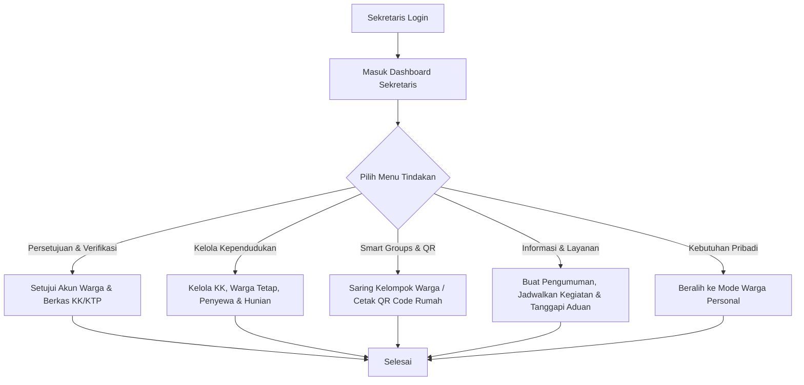
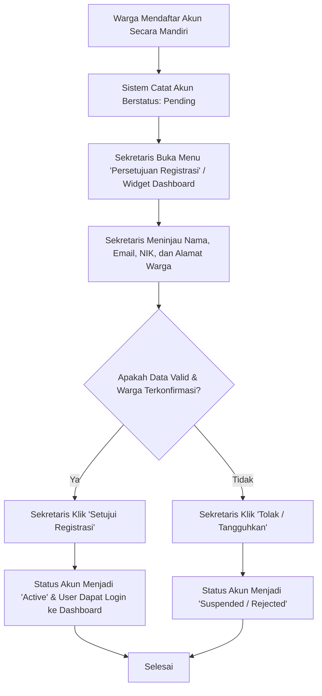
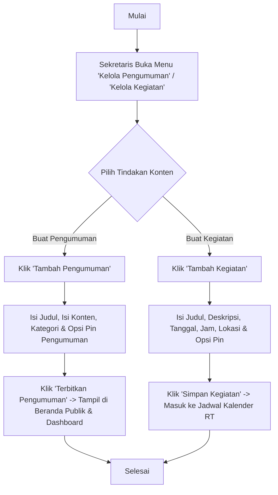
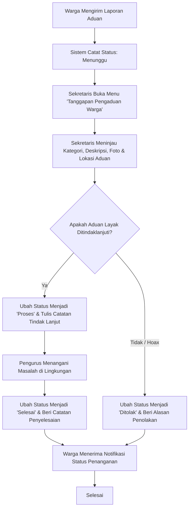
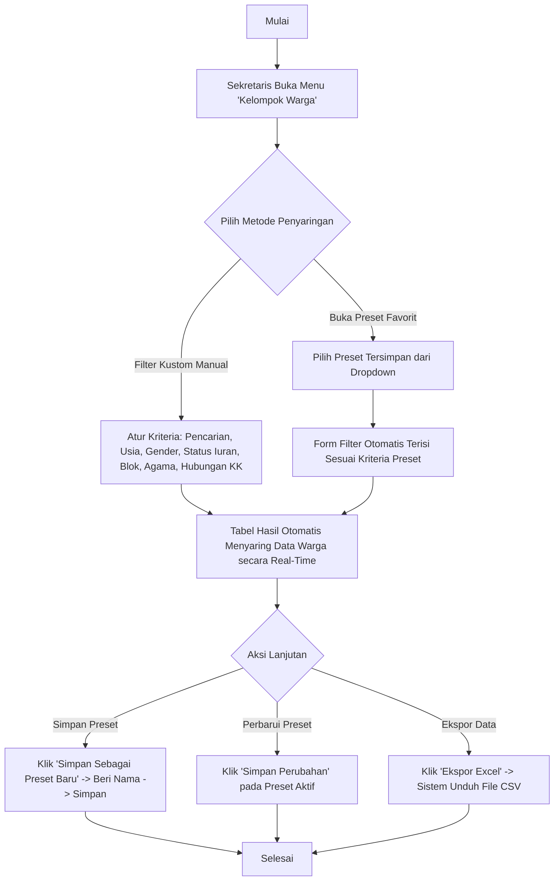

# Panduan Peran & Fitur: Sekretaris

Sekretaris adalah pelaksana administrasi operasional utama RT yang bertugas mengelola publikasi informasi resmi, jadwal kegiatan lingkungan, merespons pengaduan warga, memproses antrean persetujuan registrasi akun dan berkas kependudukan, serta mengelola data kependudukan dan hunian RT.

---

## 1. Navigasi & Struktur Menu (Sitemap)

Ketika Sekretaris login ke sistem, menu navigasi sidebar meliputi:

*   **Dashboard:** Ringkasan metrik registrasi pending, aduan masuk, agenda kegiatan mendatang, pengumuman terbaru, dan antrean verifikasi warga (`/dashboard`).
*   **Modul Kependudukan & Hunian RT:** (Menu Dropdown Accordion)
    *   **Data Warga & Hunian:** Pengelolaan data Kartu Keluarga (KK), warga tetap, penyewa kos, hunian fisik, dan koordinator kos (`/dashboard/residents`).
    *   **Kelompok Warga:** Penyaringan data warga terpadu dan manajemen preset filter kustom (Smart Groups) (`/dashboard/smart-groups`).
    *   **Cetak QR Code RT:** Pembuatan, pengunduhan individual, dan pencetakan massal PDF QR Code hunian & sekretariat (`/dashboard/qr-codes`).
*   **Antrean Persetujuan:** (Menu Dropdown Accordion)
    *   **Persetujuan Registrasi:** Verifikasi dan persetujuan pendaftaran akun warga mandiri (`/dashboard/approvals/registration`).
    *   **Verifikasi Kependudukan:** Verifikasi berkas scan KK dan KTP warga serta penyewa kos (`/dashboard/approvals/documents`).
*   **Portal Informasi & Layanan:** (Menu Dropdown Accordion)
    *   **Kelola Pengumuman:** Pembuatan, pengeditan, dan publikasi pengumuman warga (`/dashboard/announcements`).
    *   **Kelola Kegiatan RT:** Penjadwalan agenda kegiatan dan event lingkungan RT (`/dashboard/activities`).
    *   **Tanggapan Pengaduan Warga:** Tindak lanjut, pengisian catatan respon, dan pembaruan status laporan keluhan warga (`/dashboard/complaints`).
*   **Kelola Penyewa Kos:** Pengawasan dan pengelolaan data rumah sewa, kamar kos, dan penghuni sewa (`/dashboard/rentals`).
*   **Fitur Personal (Mode Warga):** Melalui fitur *Switch Role* di Navbar, Sekretaris dapat beralih ke *Mode Warga Personal* untuk mengelola data keluarga pribadi (`/dashboard/family`), melihat peta tetangga (`/dashboard/neighborhood`), histori iuran mandiri (`/dashboard/my-fees`), dan aset properti milik sendiri (`/dashboard/my-properties`).

---

## 2. Fitur & Tugas Utama

*   **SE-01: Dashboard Sekretaris RT (Pusat Administrasi)**
    Menyajikan metrik operasional administrasi dan antrean tugas teraktual:
    *   **3 KPI Cards Ringkasan:**
        *   `Registrasi Akun Pending`: Jumlah pendaftaran akun warga mandiri yang menunggu verifikasi.
        *   `Aduan Perlu Tindakan`: Jumlah laporan keluhan warga yang berstatus *Menunggu*.
        *   `Kegiatan RT Mendatang`: Jumlah jadwal agenda kegiatan lingkungan RT terdekat.
    *   **Widget Operasional:**
        *   `Antrean Persetujuan Warga`: Tabel registrasi warga pending dengan tombol cepat untuk menyetujui atau menolak akun langsung dari dashboard.
        *   `Agenda Kegiatan Terdekat`: Widget daftar kegiatan mendatang lengkap dengan tanggal, waktu, dan lokasi.
        *   `Pengumuman Terbaru`: Rekapitulasi pengumuman warga yang aktif dipublikasikan.
        *   `Laporan Pengaduan Terkini`: Tabel laporan aduan terbaru dengan tracking code dan status penanganannya.

*   **SE-02: Pengelolaan Kependudukan & Hunian RT (`/dashboard/residents`)**
    *   **Kartu Keluarga (KK):** Pendaftaran KK baru dan akun Kepala Keluarga, pembaruan biodata keluarga, nonaktifkan KK (*check-out*), dan aktivasi kembali KK.
    *   **Penyewa Kos/Kontrakan:** Input *check-in* penyewa baru, verifikasi berkas identitas penyewa, pembaruan kontrak, dan pemrosesan *check-out*.
    *   **Hunian Fisik:** Pendaftaran nomor rumah/blok hunian permanen, kos, maupun homestay.
    *   **Koordinator Kos:** Penunjukan akun koordinator kos baru dan pengelolaan properti kelolaannya.

*   **SE-03: Kelompok Warga Dinamis (Smart Groups) & Ekspor Data (`/dashboard/smart-groups`)**
    *   **Filter Terpadu Multi-Kriteria (`CitizenFilterBar`):** Penyaringan data warga terpadu berdasarkan Nama/NIK, rentang usia, jenis kelamin, status iuran RT, tipe tempat tinggal, blok rumah, agama, jenis pekerjaan, dan hubungan keluarga.
    *   **Manajemen Preset Favorit:** Menyimpan kombinasi filter sebagai preset baru, membuka preset tersimpan, memperbarui preset, dan mereset filter.
    *   **Ekspor Data:** Mengunduh daftar warga terfilter dalam format file CSV/Excel bertanda UTF-8 BOM (`daftar_warga_terfilter_[tanggal].csv`).

*   **SE-04: Antrean Persetujuan & Verifikasi Dokumen (`/dashboard/approvals`)**
    *   **Persetujuan Registrasi:** Meninjau dan menyetujui/menolak permohonan pendaftaran akun warga mandiri (`pending` -> `active` / `rejected`).
    *   **Verifikasi Berkas KK/KTP:** Memeriksa berkas scan KK dan KTP warga serta penyewa untuk memastikan validitas identitas kependudukan (`pending` -> `verified` / `rejected`).

*   **SE-05: Portal Informasi & Penanganan Aduan Warga (`/dashboard/announcements`, `activities`, `complaints`)**
    *   **Kelola Pengumuman:** Pembuatan dan publikasi berita/himbauan resmi dengan opsi *pin/unpin* info penting dan kategori (Umum, Penting, Mendesak).
    *   **Kelola Kegiatan RT:** Penjadwalan agenda rapat warga, kerja bakti, posyandu, atau peringatan hari besar.
    *   **Tanggapan Pengaduan Warga:** Penanganan laporan aduan warga, penulisan respon tindak lanjut, dan perubahan status aduan (*Menunggu* -> *Proses* -> *Selesai* / *Ditolak*).

*   **SE-06: Cetak QR Code RT (`/dashboard/qr-codes`)**
    *   Pencetakan dan pengunduhan QR Code nomor rumah/hunian warga dan sekretariat RT secara individual maupun cetak massal format PDF.

*   **SE-07: Fitur Dual Role (Mode Warga Personal)**
    *   Sekretaris RT dapat berganti peran secara instan ke *Mode Warga Personal* untuk mengelola data anggota keluarganya sendiri, memantau iuran pribadi, dan melihat aset sewa pribadi tanpa perlu keluar dari akun.

---

## 3. Alur Kerja Utama (Flowchart)

---

## 4. Alur Kerja Detail (User Flow)

### 4.1 Flow Persetujuan Registrasi Akun Warga Baru

### 4.2 Flow Publikasi Pengumuman & Agenda Kegiatan

### 4.3 Flow Penanganan & Respon Pengaduan Warga

### 4.4 Flow Penyaringan Warga & Manajemen Preset (Smart Groups)

