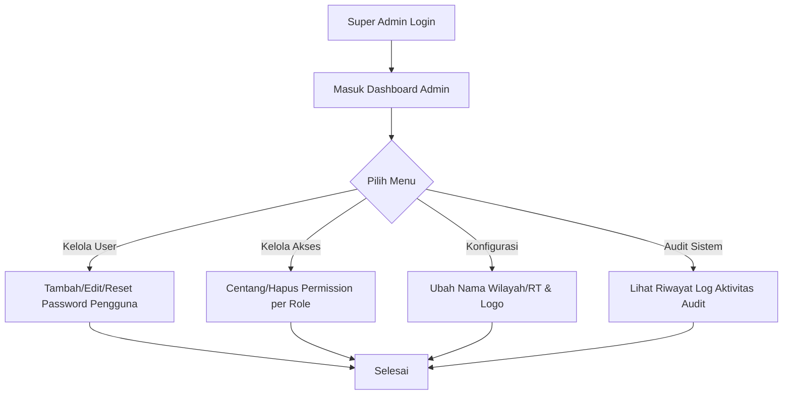
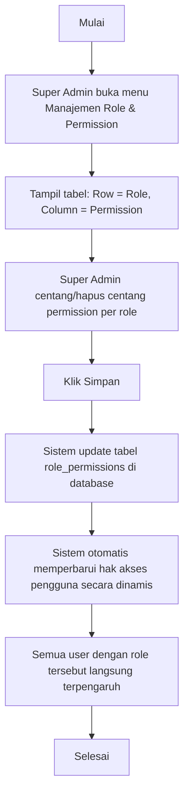
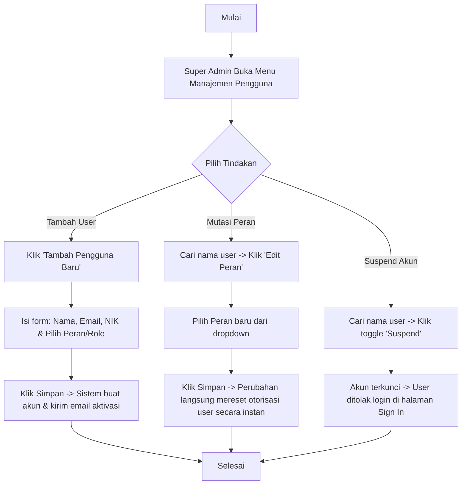
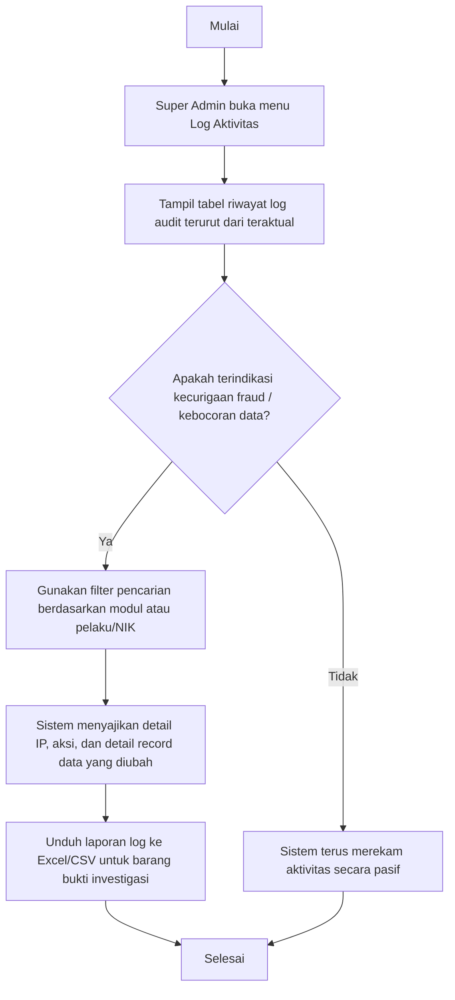
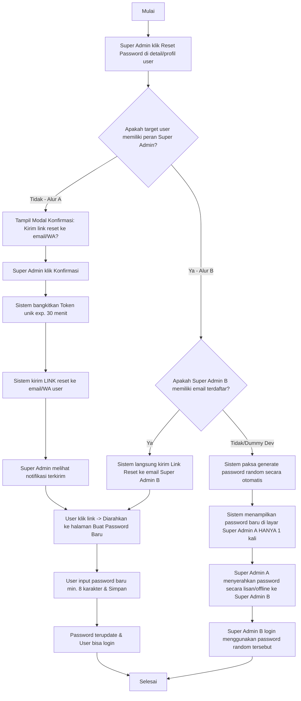

# Panduan Peran & Fitur: Super Admin

Super Admin adalah pemilik sistem (developer/administrator teknis) yang memiliki hak akses mutlak untuk mengonfigurasi sistem, memantau aktivitas, dan mengelola akun-akun tingkat pengurus RT.

---

## 1. Navigasi & Struktur Menu (Sitemap)

Ketika Super Admin login, menu sidebar utama meliputi:
*   **Dashboard Utama:** Ringkasan statistik sistem global (jumlah RT aktif, total pengguna, audit status).
*   **Keamanan & Otoritas:** (Menu Utama)
    *   **Manajemen Pengguna:** (Sub-menu) Daftar seluruh akun pengguna (CRUD, reset password, mutasi peran).
    *   **Role & Permission (RBAC):** (Sub-menu) Pengaturan hak akses dinamis bagi masing-masing role.
    *   **Log Aktivitas (Audit Trail):** (Sub-menu) Riwayat pencatatan aksi/mutasi krusial pengguna untuk keamanan.
*   **Pemantauan Wilayah (Read-Only):** (Menu Utama)
    *   **Data Kependudukan:** (Sub-menu) Melihat seluruh data KK & warga di tingkat RT.
    *   **Laporan Keuangan Kas:** (Sub-menu) Memantau rekaman kas masuk/keluar Bendahara.
    *   **Postingan & Pengaduan:** (Sub-menu) Memantau seluruh pengumuman aktif & laporan aduan warga.
*   **Konfigurasi Sistem:** (Menu Utama - Direct Link) Setelan nama desa, kelurahan, logo aplikasi, dan informasi kontak official.

---

## 2. Fitur & Tugas Utama

*   **SA-01: Dashboard Ringkasan Utama (Global Overview Dashboard)**
    Menyajikan metrik performa operasional dan kesehatan finansial RT secara menyeluruh dalam satu layar:
    *   `Total Warga Terdaftar`: Jumlah kumulatif warga tetap dan penyewa aktif.
    *   `Keluarga Aktif`: Total Kepala Keluarga (KK) yang status datanya `Verified`.
    *   `Saldo Kas RT Terkini`: Jumlah nominal saldo kas riil (sinkronisasi dari dashboard Bendahara).
    *   `Antrean Dokumen Pending`: Jumlah KK baru yang mengunggah scan berkas dan butuh verifikasi.
    *   `Aduan Warga Aktif`: Laporan keluhan warga yang berstatus `Menunggu` atau `Proses`.
*   **SA-02: Manajemen Pengguna (User Account Management - CRUD)**
    Pengelolaan siklus hidup akun pengguna sistem Wargaku:
    *   **Tambah Pengguna Manual:** Pengisian form (Nama, Email, NIK unik, Pilihan Role) untuk registrasi cepat. Maksimal 2 akun Super Admin aktif/pending di sistem.
    *   **Suspend / Aktivasi Akun:** Tombol toggle untuk menangguhkan akun secara sementara sehingga tidak bisa login. Akun Super Admin tidak dapat ditangguhkan oleh diri sendiri atau oleh sesama Super Admin (status dilindungi). Proses aktivasi kembali (*unsuspend*) akun Super Admin divalidasi agar tidak melebihi batas maksimal 2 akun aktif.
    *   **Reset Password:** Mekanisme pemulihan akun yang aman menggunakan prinsip *Zero-Knowledge* dengan pembagian alur:
        *   **Alur A (Warga, Pengurus, & Admin Biasa):** Super Admin menginisiasi pengiriman Link Reset unik (aktif 30 menit) ke email/WA pengguna tanpa mengetahui password baru. Pengguna mengisi password baru secara mandiri.
        *   **Alur B (Super Admin):** Super Admin A menginisiasi reset untuk Super Admin B. Link Reset otomatis dikirim ke email Super Admin B. Jika email tidak tersedia (misal akun dummy dev), sistem melakukan *forced random password generation* yang hanya ditampilkan sekali di layar Super Admin A untuk diserahkan secara offline/lisan kepada Super Admin B.
    *   **Mutasi Peran (Role Mutation):** Mengubah wewenang/hak akses warga/pengurus secara langsung (misal mempromosikan warga biasa menjadi Sekretaris atau Bendahara). Fitur mutasi ini terkunci untuk akun Super Admin: pilihan "Super Admin" dihilangkan dari dropdown mutasi peran, akun Super Admin tidak dapat dimutasi ke peran operasional lain, dan peran operasional tidak dapat dimutasi menjadi Super Admin (Super Admin baru hanya bisa dibuat secara bersih via Tambah Pengguna Baru). Perubahan peran operasional **hanya memperbarui kolom `role` di tabel `users`** tanpa mengganggu data kependudukan mereka di tabel `families` maupun `family_members`.
*   **SA-03: Manajemen Role & Permission (Dynamic RBAC Matrix)**
    Mengatur pembagian hak akses fitur secara modular dan dinamis:
    *   **Matriks Hak Akses:** Tabel visual dengan baris berisi 6 role (Super Admin, Ketua RT, Sekretaris, Bendahara, Koordinator Properti Sewa, Warga) dan kolom berisi izin modul (`read_kependudukan`, `write_kependudukan`, `read_kas`, `write_kas`, `approve_kas`, `manage_properti`, `manage_complaint`, dll.).
    *   **Pembaruan Instan:** Men-centang atau menghapus centang langsung memperbarui aturan otorisasi di backend (API middleware) dan frontend (visibilitas menu sidebar) secara real-time.
*   **SA-04: Lihat Kependudukan (Read-Only)**
    Melihat seluruh data warga, KK, properti sewa, dan data anak kos dari tingkat RT secara read-only guna mengawasi keakuratan data kependudukan secara teknis tanpa berwenang mengubahnya.
*   **SA-05: Lihat Keuangan (Read-Only)**
    Melihat seluruh mutasi arus kas masuk, kas keluar, dan iuran bulanan yang diinput Bendahara secara read-only untuk memantau integritas data kas RT.
*   **SA-06: Lihat Pengumuman & Laporan (Read-Only)**
    Melihat seluruh daftar postingan pengumuman, agenda kegiatan, serta laporan aduan warga yang masuk di tingkat RT secara read-only.
*   **SA-07: Pengaturan Sistem (Identitas Wilayah)**
    Mengatur kustomisasi branding dan metadata wilayah:
    *   `Nama RT/RW` (misal: RT 03 / RW 08).
    *   `Kelurahan / Desa` (misal: Kelurahan Mulyorejo).
    *   `Kecamatan & Kota/Kabupaten` (misal: Kec. Sukolilo, Kota Surabaya).
    *   `Logo RT / Korp`: Upload berkas gambar (.png/.jpg) untuk ditampilkan di header aplikasi.
    *   `Alamat Sekretariat RT`, `Email Resmi RT`, & `Kontak Pengurus` (Nomor HP/WA Official Ketua RT, Sekretaris, & Bendahara).
*   **SA-08: Log Aktivitas (Audit Trail & Security Log)**
    Catatan riwayat transaksi data yang tidak dapat dimanipulasi oleh pengguna lain untuk melacak kebocoran data atau kecurangan keuangan:
    *   **Deteksi Aksi:** Log merekam aksi login, tambah data, edit data, hapus data, serta perubahan status verifikasi dokumen/kas.
    *   **Metadata Log:** Setiap log mencantumkan `Timestamp` (waktu), `Pelaku` (Nama & NIK), `Modul terkait` (Kependudukan, Keuangan), `Deskripsi Detail` (contoh: *"Mengubah saldo kas keluar Rp 500.000 menjadi Approved"*), serta `IP Address & User Agent` pelaku.
*   **SA-09: Isolasi Peran & Integrasi NIK Profil (Role Isolation & Profile NIK)**
    Pencegahan pencampuran data operasional dan data administratif:
    *   **Lock Mode Tampilan:** Akun Super Admin terkunci sepenuhnya pada mode administrasi global. Menu switch role (beralih mode tampilan ke Warga/Pengurus) dinonaktifkan seluruhnya dari dropdown profil.
    *   **Integrasi NIK Profil:** Jika Super Admin memiliki NIK yang terdaftar sebagai warga di wilayah RT setempat (tabel `family_members`), data kependudukan pribadi miliknya (anggota keluarga, KK, alamat) dapat dibaca secara otomatis di profilnya dalam format read-only tanpa harus berpindah ke dashboard warga.

---

## 3. Alur Kerja Utama (Flowchart)

---

## 4. Alur Kerja Detail (User Flow)

### 4.1 Flow Role & Permission (Super Admin)

### 4.2 Flow Manajemen Pengguna & Mutasi Peran (Super Admin)

### 4.3 Flow Audit Trail Keamanan (Super Admin)

### 4.4 Flow Reset Password (Zero-Knowledge)

