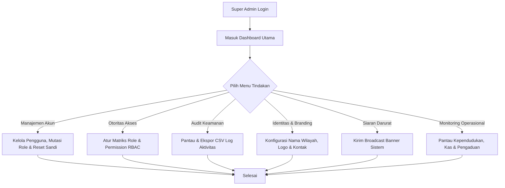
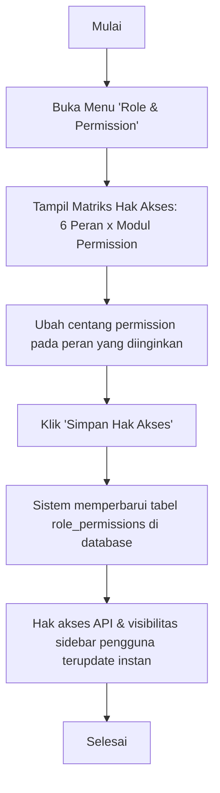
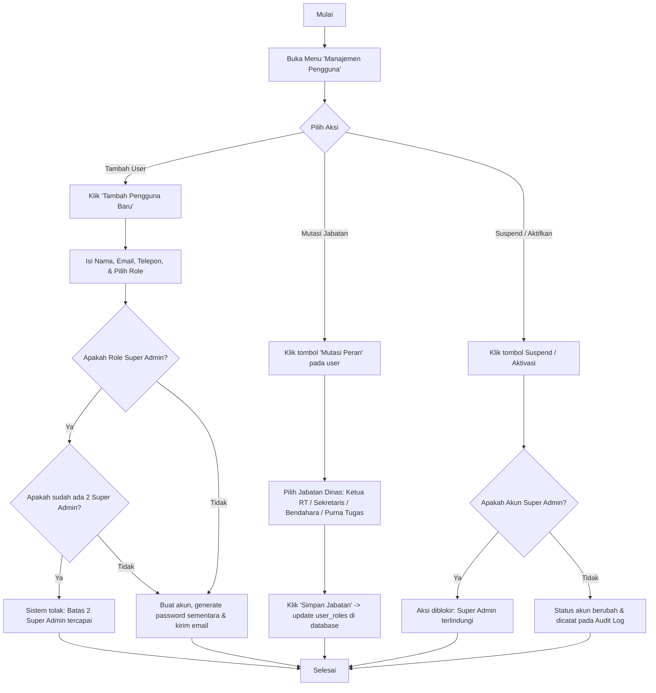
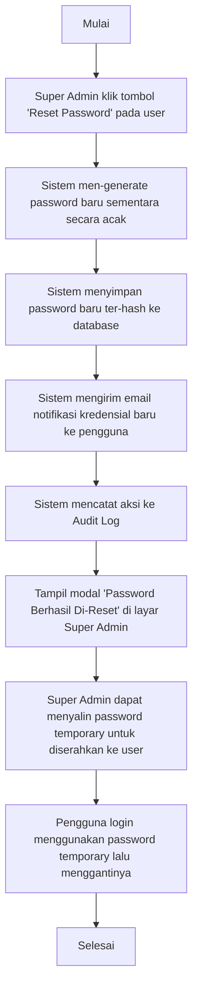
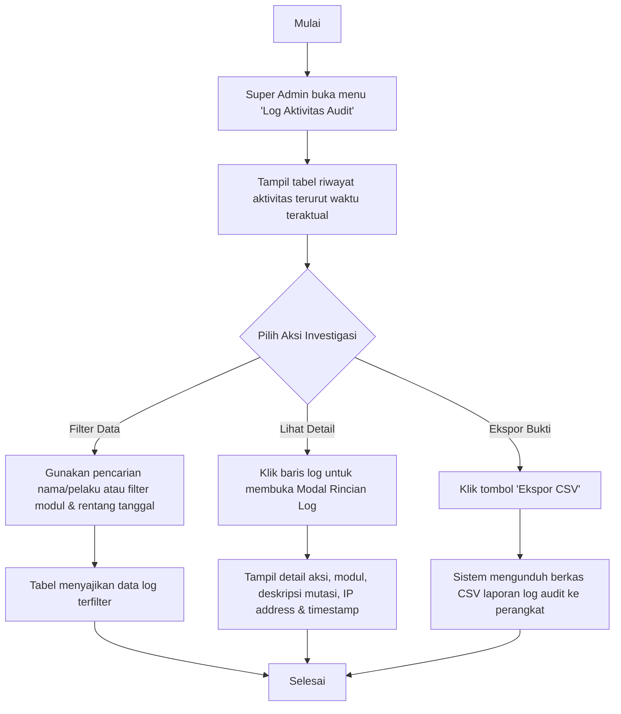

# Panduan Peran & Fitur: Super Admin

Super Admin adalah pemilik dan pengelola sistem (teknis/administrator utama) yang memiliki hak akses tertinggi untuk mengonfigurasi sistem, mengatur hak akses (RBAC), memantau aktivitas audit keamanan, mengelola akun pengguna, serta memantau operasional lingkungan RT secara menyeluruh.

---

## 1. Navigasi & Struktur Menu (Sitemap)

Ketika Super Admin login, menu sidebar navigasi mencakup:

*   **Dashboard:** Ringkasan statistik performa global, distribusi peran, identitas wilayah, dan log audit keamanan terkini (`/dashboard`).
*   **Manajemen Pengguna:** Pengelolaan seluruh akun pengguna sistem (CRUD, edit profil, mutasi jabatan pengurus, reset password sementara, toggle suspend/aktifkan) (`/dashboard/users`).
*   **Keamanan & Otoritas:** (Menu Dropdown Accordion)
    *   **Role & Permission:** Matriks pengelolaan hak akses izin dinamis (RBAC Matrix) untuk 6 role (`/dashboard/permissions`).
    *   **Log Aktivitas Audit:** Catatan rekam jejak audit trail seluruh aksi & mutasi data dalam sistem (`/dashboard/audit-logs`).
*   **Laporan Pengaduan Global:** Rekapitulasi pemantauan seluruh laporan aduan warga tingkat wilayah (`/dashboard/complaints-report`).
*   **Konfigurasi Sistem:** Pengaturan identitas wilayah RT/RW, branding logo kop surat, alamat sekretariat, kontak official pengurus, dan kontak darurat warga (`/dashboard/system-config`).
*   **Broadcast Sistem:** Pengelolaan siaran darurat / pengumuman banner global yang tampil di atas dashboard seluruh pengguna (`/dashboard/system-broadcast`).
*   **Modul Kependudukan & Hunian RT:** (Menu Dropdown Accordion)
    *   **Data Warga & Hunian:** Pemantauan data KK, warga tetap, penyewa kos, hunian, dan koordinator kos (`/dashboard/residents`).
    *   **Kelompok Warga:** Pengelompokan warga dinamis berbasis filter kriteria (Smart Groups) (`/dashboard/smart-groups`).
    *   **Cetak QR Code RT:** Pembuatan dan pencetakan QR Code penanda rumah & hunian (`/dashboard/qr-codes`).
*   **Antrean Persetujuan:** (Menu Dropdown Accordion)
    *   **Persetujuan Registrasi:** Verifikasi permohonan pendaftaran akun pengguna baru (`/dashboard/approvals/registration`).
    *   **Verifikasi Kependudukan:** Verifikasi berkas scan KK dan KTP warga (`/dashboard/approvals/documents`).
*   **Kas RT (Cashflow):** (Menu Dropdown Accordion)
    *   **Catat Pemasukan Kas:** Pencatatan dan monitoring kas masuk RT (`/dashboard/cash/income`).
    *   **Catat Pengeluaran Kas:** Pencatatan dan monitoring kas keluar RT (`/dashboard/cash/expense`).
    *   **Laporan Keuangan Kas RT:** Rekapitulasi arus kas, grafik kategori, dan cetak PDF laporan keuangan (`/dashboard/cash/reports`).
*   **Iuran Warga:** (Menu Dropdown Accordion)
    *   **Kelola & Setor Iuran:** Pengaturan aturan tarif dan input setoran iuran warga (`/dashboard/dues/manage`).
    *   **Laporan Tunggakan Iuran:** Rekapitulasi status pembayaran dan tunggakan iuran KK (`/dashboard/dues/arrears`).
*   **Portal Informasi & Layanan:** (Menu Dropdown Accordion)
    *   **Kelola Pengumuman:** Pembuatan dan penerbitan pengumuman warga (`/dashboard/announcements`).
    *   **Kelola Kegiatan RT:** Agenda jadwal kegiatan dan event lingkungan RT (`/dashboard/activities`).
    *   **Tanggapan Pengaduan Warga:** Tindak lanjut dan penanganan laporan keluhan warga (`/dashboard/complaints`).
*   **Kelola Penyewa Kos:** Pengelolaan data rumah sewa, kamar kos, dan penyewa (`/dashboard/rentals`).

---

## 2. Fitur & Tugas Utama

*   **SA-01: Dashboard Ringkasan Utama (Global Overview Dashboard)**
    Menyajikan metrik performa operasional, demografi, dan kesehatan finansial RT secara menyeluruh dalam satu layar:
    *   `Total Warga`: Jumlah kumulatif warga tetap (anggota keluarga aktif) dan penyewa aktif perorangan.
    *   `KK Terverifikasi`: Total Kartu Keluarga (KK) yang aktif di sistem.
    *   `Saldo Kas RT`: Saldo kas riil saat ini (total pemasukan dikurangi total pengeluaran).
    *   `Verifikasi Pending`: Jumlah antrean berkas KK/warga yang menunggu verifikasi + akun registrasi pending.
    *   `Aduan Aktif`: Total laporan pengaduan warga dengan status `Menunggu` atau `Proses`.
    *   `Audit Log Hari Ini`: Jumlah mutasi atau aktivitas sistem yang terekam pada hari berjalan.
    *   `Admin Quick Actions Grid`: Pintasan cepat menuju Tambah Pengguna, Role & Permission, Konfigurasi Sistem, dan Log Audit.
    *   `Identitas Wilayah Card`: Ringkasan instan nama RT/RW, kelurahan, kecamatan, kota, alamat sekretariat, dan email resmi.
    *   `Distribusi Peran Pengguna (RBAC Widget)`: Visualisasi sebaran total akun per peran (Super Admin, Ketua RT, Sekretaris, Bendahara, Koordinator Kost, Warga).
    *   `Log Audit Terkini`: Tabel 10 aktivitas mutasi sistem terbaru secara real-time.

*   **SA-02: Manajemen Pengguna (User Account Management - CRUD)**
    Pengelolaan siklus hidup dan otoritas akun pengguna sistem Wargaku:
    *   **Tambah Pengguna Manual:** Pendaftaran akun baru melalui form (Nama, Email, Telepon, Role). Mendukung pembuatan akun sekaligus penautan data keluarga/NIK. Sistem memberlakukan validasi kuota maksimal **2 akun Super Admin** aktif/pending.
    *   **Edit Data Pengguna:** Pembaruan nama lengkap, email, dan nomor kontak pengguna.
    *   **Suspend / Aktivasi Akun:** Penangguhan akun sementara (user tidak bisa login ke dashboard). Akun Super Admin dilindungi dengan mekanisme *mutual protection* (tidak dapat menangguhkan diri sendiri atau sesama Super Admin).
    *   **Reset Password (Kredensial Sementara):** Mekanisme pemulihan akun di mana sistem membangkitkan *temporary password* acak baru yang aman, memperbarui akun, mengirim email notifikasi resmi berisi kredensial ke user, dan menampilkan modal salin password di layar admin untuk diserahkan langsung jika diperlukan.
    *   **Mutasi Jabatan Pengurus RT:** Penunjukan dan pergantian jabatan struktural pengurus dinas:
        *   Pilihan peran dinas: *Ketua RT (Role 2)*, *Sekretaris RT (Role 3)*, *Bendahara RT (Role 4)*, atau *Purna Tugas / Non-Pengurus (Role 6/Warga)*.
        *   Tiap pengguna hanya dapat memegang maksimal 1 jabatan dinas RT.
        *   Peran Super Admin terkunci (tidak bisa dimutasi ke jabatan operasional, dan peran operasional tidak dapat dimutasi menjadi Super Admin via modal mutasi).
        *   Perubahan jabatan hanya memperbarui data wewenang di tabel `user_roles` tanpa mengganggu data kependudukan mereka di tabel `families` maupun `family_members`.

*   **SA-03: Manajemen Role & Permission (Dynamic RBAC Matrix)**
    Pengaturan matriks hak akses fitur modular dan dinamis untuk 6 role:
    *   **Matriks Visual Hak Akses:** Tabel matriks terkelompok per modul (`kependudukan`, `hunian`, `verifikasi`, `kas_rt`, `iuran_warga`, `pengumuman`, `kegiatan`, `laporan`, `properti`, `pengguna`, `warga`).
    *   **Proteksi Hak Akses Kritis:**
        *   Permission otoritas keamanan sistem (`manage-users`, `manage-roles`, `view-audit-logs`, `view-complaints-report`, `manage-system-config`) dikunci khusus Super Admin.
        *   Permission untuk Koordinator Kost (Role 5) dan Warga (Role 6) bersifat paten dan dilindungi sistem.
    *   **Penyimpanan Dinamis:** Mengubah centang permission dan menekan tombol *Simpan* langsung memperbarui tabel `role_permissions` di database dan berdampak instan pada otorisasi API serta menu navigasi sidebar.

*   **SA-04: Log Aktivitas (Audit Trail Keamanan)**
    Pencatatan riwayat transaksi dan mutasi sistem yang tidak dapat dimanipulasi untuk kebutuhan investigasi dan akuntabilitas:
    *   **Perekaman Mutasi:** Mencatat aksi login, create, update, delete, suspend, aktivasi, reset password, persetujuan berkas, dan transaksi kas.
    *   **Metadata Log:** Menampilkan Waktu (*Timestamp*), Pelaku, Modul Terkait, Deskripsi Mutasi Detail, dan Alamat IP Pelaku.
    *   **Filter & Pencarian:** Filter berdasarkan modul, pencarian kata kunci, serta rentang tanggal.
    *   **Ekspor Data:** Fitur pengunduhan laporan log audit ke format file CSV.
    *   **Modal Detail Log:** Peninjauan rincian log audit secara mendalam.

*   **SA-05: Laporan Pengaduan Global**
    Pemantauan terpusat seluruh aduan keluhan warga lintas kategori (Infrastruktur, Kebersihan, Keamanan, Sosial, dll.) serta status tindak lanjutnya.

*   **SA-06: Pengaturan Sistem (Identitas Wilayah & Branding)**
    Konfigurasi identitas resmi lingkungan RT dan branding kop surat:
    *   `Nama RT / RW` (misal: RT 001 / RW 005).
    *   `Desa / Kelurahan`, `Kecamatan`, dan `Kota / Kabupaten`.
    *   `Koordinat Wilayah` (Latitude & Longitude).
    *   `Logo RT / Wilayah`: Upload berkas gambar logo untuk kop surat dan branding aplikasi.
    *   `Alamat Sekretariat RT` dan `Email Resmi RT`.
    *   `Kontak Official Pengurus`: Nomor WhatsApp/telepon resmi Ketua RT, Sekretaris, dan Bendahara.
    *   `Kontak Darurat Warga`: Pengelolaan daftar kontak darurat lingkungan (Polsek, Pemadam Kebakaran, Ambulans, Puskesmas, Babinsa, dll.).

*   **SA-07: Broadcast Banner Sistem**
    Penerbitan notifikasi darurat / pengumuman banner global sistem yang tampil mencolok di bagian atas dashboard seluruh pengguna yang sedang aktif.

*   **SA-08: Profil & Keamanan Akun Super Admin**
    *   **Isolasi Peran:** Super Admin fokus pada administrasi global sistem tanpa fitur berpindah mode (switch role) ke Warga/Pengurus dari profil.
    *   **Kelola Data Diri:** Pengubahan nama, nomor telepon, dan unggah foto profil (avatar).
    *   **Keamanan Sandi:** Penggantian password mandiri dengan verifikasi password lama.
    *   **Notifikasi:** Konfigurasi langganan Web Push Notification (OneSignal).

---

## 3. Alur Kerja Utama (Flowchart)

---

## 4. Alur Kerja Detail (User Flow)

### 4.1 Flow Role & Permission (Super Admin)

### 4.2 Flow Manajemen Pengguna, Mutasi & Suspend (Super Admin)

### 4.3 Flow Reset Password Pengguna

### 4.4 Flow Audit Trail Keamanan & Ekspor CSV

