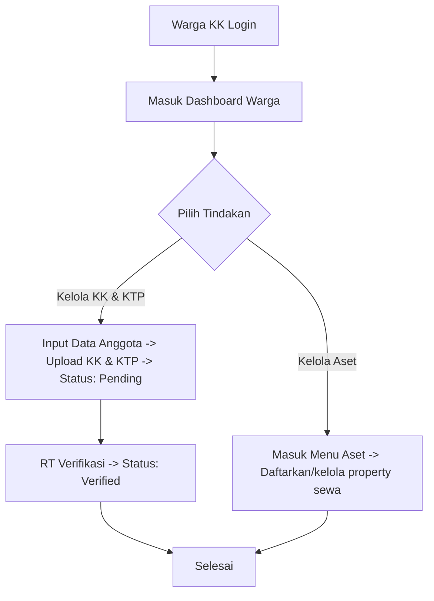
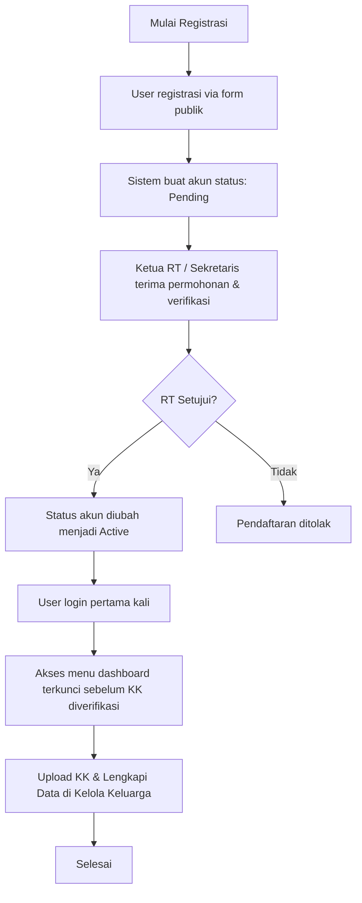
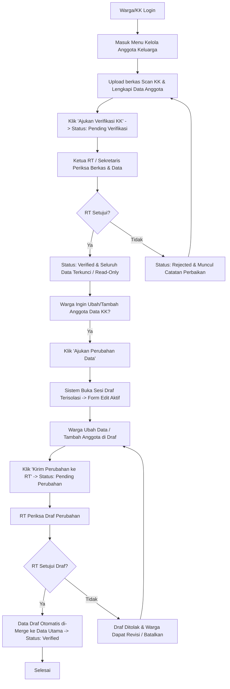
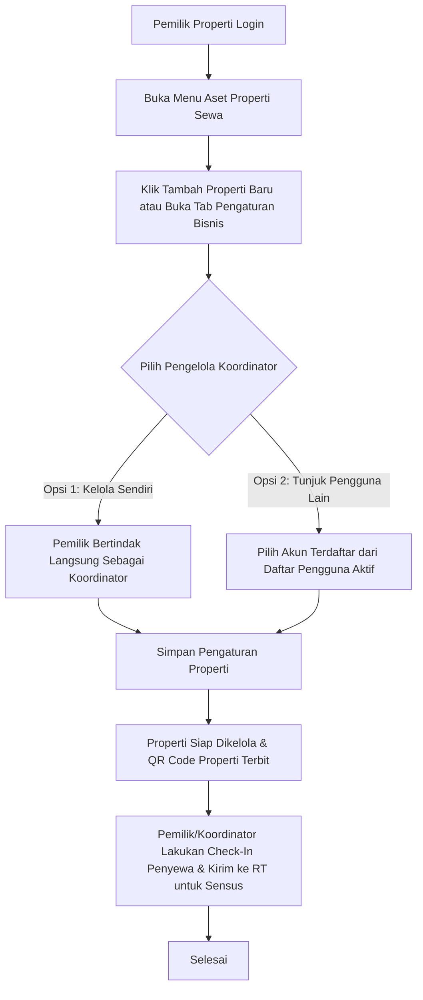

# Panduan Peran & Fitur: Warga (Kepala Keluarga)

Warga (Kepala Keluarga) adalah pengguna akhir utama sistem yang memiliki hak akses untuk melengkapi data anggota keluarganya secara mandiri, mengelola properti sewaan yang dimilikinya.

---

### 1. Navigasi & Struktur Menu (Sitemap)

Ketika Warga (Kepala Keluarga) login ke dalam sistem, susunan menu sidebar terdiri dari:

1. **Dashboard (`/dashboard`)**
   * *Icon:* `LayoutDashboard` | *Permission:* Publik bagi semua user terotentikasi.
   * *Konten:* Ringkasan tagihan iuran keluarga, ringkasan pengumuman internal RT, detail rumah tinggal (dengan tombol **`[Unduh QR Code Rumah]`** setelah terverifikasi), status pengajuan verifikasi keluarga, dan tautan cepat ke Layanan Publik.

2. **Kelola Anggota Keluarga (`/dashboard/family`)**
   * *Icon:* `User` | *Permission:* `manage-family-profile`
   * *Akses:* Terbuka secara default (satu-satunya menu yang langsung aktif setelah login pertama kali).
   * *Konten:* Form pengisian biodata Kepala Keluarga, upload berkas scan KK & KTP asli, penambahan anggota keluarga (Istri, Anak, Orang Tua), dan tombol pengajuan perubahan data KK.

3. **Peta Hunian & Tetangga (`/dashboard/neighborhood`)**
   * *Icon:* `Search` | *Permission:* `view-neighborhood-map` | *Feature Gate:* 🔒 `requiresVerification: true`
   * *Akses:* Terkunci dengan ikon gembok hingga status verifikasi KK berstatus `Verified` oleh RT.
   * *Konten:* Peta interaktif hunian wilayah RT dan direktori pencarian tetangga dengan proteksi privasi PII (*Data Masking* NIK 3-awal/3-akhir dan HP 08-awal/3-akhir).

4. **Status & Histori Iuran (`/dashboard/my-fees`)**
   * *Icon:* `Wallet` | *Permission:* `view-my-fees` | *Feature Gate:* 🔒 `requiresVerification: true`
   * *Akses:* Terkunci hingga status verifikasi KK berstatus `Verified` oleh RT.
   * *Konten:* Rekap tagihan iuran keluarga per bulan, status lunas/tunggakan, rincian aturan tarif iuran KK aktif, dan riwayat pembayaran yang telah disetor ke Bendahara.

5. **Aset Properti Sewa (`/dashboard/my-properties`)**
   * *Icon:* `Building2` | *Permission:* `manage-my-properties` | *Feature Gate:* 🔒 `requiresVerification: true`
   * *Akses:* Terkunci hingga status verifikasi KK berstatus `Verified` oleh RT.
   * *Konten:* Halaman utama pengelolaan seluruh aset properti sewaan pribadi yang dimiliki (Kos, Kontrakan, Homestay).
     * *Tampilan:* Kartu daftar properti pribadi beserta tombol **`[+ Daftarkan Properti Baru]`**.
     * *Detail Properti (3 Tab):*
        1. **Tab Kamar & Penghuni:** Menampilkan grid kamar dan daftar penyewa aktif (Pemantauan *Read-Only* & tombol **`[Detail]`** biodata).
        2. **Tab Pengaturan Bisnis:** Menyetel jumlah kamar, nama properti, nomor kontak WA pengelola, penunjukan Koordinator, dan unduh QR Code properti.
        3. **Tab Riwayat Sewa:** Melacak riwayat masa tinggal mantan penyewa unit tersebut.

---

### 1.1 Fitur Tambahan Antarmuka Warga
* **Role Switcher (Peralihan Tampilan):** Jika Warga Tetap terpilih menjadi pengurus RT (RT/Sekretaris/Bendahara), terdapat tombol di sudut kanan atas profil untuk beralih mode tampilan ("Panel Pengurus" $\leftrightarrow$ "Tampilan Warga") guna merubah susunan menu sidebar secara dinamis.
* **Pemisahan Notifikasi Internal:** Notifikasi lonceng disaring otomatis berdasarkan Mode Tampilan aktif (`category = 'personal'` saat mode warga, dan `category = 'dinas'` saat mode pengurus) agar urusan rumah tangga pribadi tidak bercampur dengan tugas RT.

---

## 2. Fitur & Tugas Utama

*   **WR-01: Pendaftaran Mandiri Warga & Keluarga**
    *   **Tahap 1: Registrasi Akun Awal (Halaman Publik `/register` - Menunggu Persetujuan RT):**
        Proses registrasi menggunakan formulir bertahap (*2-Step Wizard*):
        *   **Pilihan Tipe Akun:** Memilih opsi **`Warga (Kepala Keluarga)`**.
        *   **Langkah 1: Akun & Kontak:**
            *   `Email` (Email aktif, digunakan sebagai kredensial login)
            *   `Nomor WhatsApp / HP` (10-15 digit angka, aktif untuk komunikasi RT/RW)
            *   `Password` (Minimal 6 karakter)
            *   `Konfirmasi Password` (Wajib cocok dengan password)
        *   **Langkah 2: Data Kependudukan & Tempat Tinggal:**
            *   `Nama Lengkap` (Sesuai KTP Kepala Keluarga)
            *   `NIK` (Tepat 16 digit angka, unik)
            *   `Nomor Kartu Keluarga (KK)` (Tepat 16 digit angka, unik)
            *   `Alamat Rumah / Hunian` (Wajib memilih rumah tempat tinggal dari dropdown daftar hunian RT terdaftar)
        *   *Hasil:* Akun berstatus `pending` dan menunggu persetujuan (approval) oleh Ketua RT / Sekretaris.
    *   **Tahap 2: Pengunggahan & Verifikasi Dokumen KK (Setelah Login di `/dashboard/family`):**
        *   **Kunci Akses Menu (Feature Gate):** Saat login pertama kali, menu *Peta Hunian & Tetangga*, *Status & Histori Iuran*, dan *Aset Properti Sewa* berstatus **terkunci (ikon gembok)**. Menu yang dapat diakses adalah *Dashboard* dan *Kelola Anggota Keluarga*.
        *   Warga melengkapi data dan mengunggah dokumen:
            *   `Berkas Scan KK` (Scan/foto Kartu Keluarga asli format JPG/PNG/PDF, maks 2MB)
            *   Melengkapi profil Kepala Keluarga & menambah anggota keluarga lainnya.
            *   Klik tombol **`[Ajukan Verifikasi KK]`** untuk mengirimkan berkas ke pengurus RT.
        *   **Kondisi Pembukaan Kunci:** Kunci menu lainnya akan terbuka secara otomatis setelah dokumen KK disetujui (status: `Verified`) oleh Ketua RT / Sekretaris.
        *   **Akses QR Code Rumah Tinggal:** Setelah status KK berstatus `Verified`, Kepala Keluarga dapat melihat dan mengunduh QR Code rumah tinggalnya di kartu **"Detail Rumah Tinggal"** pada halaman Dashboard Utama.
*   **WR-02: Kelola Anggota Keluarga (Lengkapi Profil Kepala Keluarga & Tambah Anggota)**
    *   **Otomatisasi & Kelengkapan Profil Kepala Keluarga:** Ketika akun diaktifkan oleh RT, sistem secara otomatis membuat baris pertama data anggota keluarga menggunakan Nama, NIK, dan hubungan `'Kepala_Keluarga'` dari registrasi awal. Warga tidak perlu mengetik ulang Nama dan NIK, tetapi **wajib mengedit data tersebut untuk melengkapi data yang belum diinput saat registrasi**, yaitu:
        *   `Jenis Kelamin` (Laki-laki / Perempuan - sangat penting untuk kasus kepala keluarga perempuan/istri karena suami meninggal atau bercerai).
        *   `Tempat Lahir` & `Tanggal Lahir`.
        *   `Berkas Scan KTP Kepala Keluarga` (Wajib diunggah).
    *   Menginput anggota keluarga lainnya (Istri, Anak, Orang Tua, dll.) satu per satu dengan data:
        *   `Nama Lengkap Anggota`
        *   `NIK Anggota` (16 digit angka, unik)
        *   `Tempat Lahir` & `Tanggal Lahir`
        *   `Jenis Kelamin` (Laki-laki / Perempuan)
        *   `Hubungan Keluarga` (Dropdown: Istri, Anak, Orang Tua, Lainnya)
        *   `Nomor HP / WhatsApp` (Opsional, untuk koordinasi darurat jika Kepala Keluarga tidak aktif)
        *   `Berkas Scan KTP Anggota` (optional untuk warga tetap dan Wajib diunggah bagi warga penyewa jika usia $\ge$ 18 tahun)
    *   **Aturan Penguncian Data & Draf Permohonan Perubahan Data (*Change Request Flow*):**
        *   **Kondisi Terkunci (Read-Only):** Jika status verifikasi keluarga adalah `Verified` atau `Pending`, seluruh data keluarga utama dikunci secara otomatis (*Read-Only*) untuk menjaga integritas data kependudukan resmi.
        *   **Mekanisme Draf Perubahan Data (*Isolated Draft*):** Sistem tidak langsung mengubah data resmi yang aktif, melainkan menggunakan mekanisme draf salinan:
            1.  **Buka Draf Perubahan:** Warga mengklik tombol **`[Ajukan Perubahan Data]`**. Sistem membuat salinan draf data keluarga tanpa merusak data resmi yang sudah aktif.
            2.  **Mode Draf Terbuka:** Kolom input, tombol tambah/edit/hapus anggota keluarga, dan upload berkas KK menjadi aktif kembali khusus pada sesi draf.
            3.  **Kirim ke Pengurus RT:** Setelah selesai melakukan modifikasi data, warga mengklik tombol **`[Kirim Perubahan ke RT]`**. Status permohonan menjadi `Pending Verifikasi Perubahan`.
            4.  **Fitur Batalkan Permohonan:** Warga dapat membatalkan draf kapan saja sebelum disetujui RT melalui tombol **`[Batalkan Permohonan]`** untuk kembali ke data resmi awal.
            5.  **Persetujuan / Penolakan RT:**
                *   Jika **Disetujui RT:** Data draf otomatis diterapkan (*merge*) menimpa data utama keluarga dan status kembali menjadi `Verified`.
                *   Jika **Ditolak RT:** Draf menampilkan catatan perbaikan dari RT dan warga dapat merevisi kembali draf tersebut.
*   **WR-03: Status & Histori Iuran Keluarga (`/dashboard/my-fees`)**
    *   **Halaman Khusus Pemantauan Iuran Warga:** Kepala Keluarga dapat mengakses menu **Status & Histori Iuran** yang menyajikan transparansi data iuran keluarga secara komprehensif:
        *   **4 Kartu KPI Ringkasan Finansial:**
            1.  `Tunggakan Bulan-Bulan Sebelumnya`: Akumulasi tagihan wajib masa lampau yang belum lunas (indikator hijau "Lunas" atau merah "Ada Tunggakan").
            2.  `Sisa Tagihan Bulan Ini`: Nominal sisa tagihan pada periode bulan berjalan (beserta total tagihan bulanan).
            3.  `Total Setoran Terinput`: Akumulasi total dana iuran yang telah disetorkan warga dan dicatat oleh Bendahara pada tahun berjalan.
            4.  `Setoran Terakhir Dicatat`: Tanggal setoran terakhir, nominal, dan jenis tarif iuran yang dibayar.
        *   **Daftar Tarif Iuran Berlaku di RT:** Menampilkan daftar kartu aturan iuran resmi yang aktif berlaku di lingkungan RT beserta nominal tarif per bulan.
        *   **Tabel Histori Pembayaran Iuran:**
            *   Menampilkan rincian: Periode, Jenis Iuran, Tagihan, Jumlah Dibayar, Sisa Tagihan, Tanggal Dicatat, Metode (`Tunai` / `Transfer`), Status (`Lunas`, `Kurang Bayar`, `Belum Bayar`), dan Nama Pengurus yang mencatat.
            *   Dilengkapi filter dropdown berdasarkan **Tahun** dan **Status Pembayaran**.
    *   **Widget Ringkasan di Beranda Dashboard:** Menampilkan cuplikan ringkas status iuran periode berjalan langsung pada halaman beranda saat warga login.
*   **WR-04: Aset Properti Sewa (Untuk Warga Pemilik Properti)**
    *   **Pendaftaran Properti Sewa Baru (`[+ Daftarkan Properti Baru]`):**
        Warga pemilik dapat mendaftarkan hunian kos, kontrakan, atau homestay miliknya dengan menginput:
        *   `Alamat Tempat Tinggal / Hunian`: Memilih rumah milik warga yang berstatus Kos/Homestay dari daftar hunian RT.
        *   `Nama Properti`: Nama komersial (misal: *Kos Mahasiswa Berkah*, *Kontrakan Melati 3 Pintu*).
        *   `Jumlah Kamar / Pintu`: Total kapasitas unit kamar hunian (`totalRooms` > 0).
        *   `Nama Kontak Pengelola`: Nama penanggung jawab operasional kos/kontrakan.
        *   `Nomor HP/WA Pengelola`: Nomor kontak untuk koordinasi penghuni atau calon penyewa.
        *   `Opsi Koordinator Pengelola`:
            *   *Kelola Sendiri:* Pemilik berperan langsung sebagai koordinator.
            *   *Tunjuk Pengguna Terdaftar:* Memilih akun koordinator dari daftar pengguna aktif di sistem.
            *   *Homestay (Sewa Harian):* Otomatis tanpa koordinator pengelola.
        *   `Catatan Tambahan`: Keterangan fasilitas/aturan (misal: *Khusus Mahasiswi*, *Listrik Token Mandiri*).
    *   **Pemantauan Penghuni & Pengaturan Aset (Halaman Detail Properti):**
        *   **Tab Kamar & Penghuni (*Read-Only Monitoring*):** Pemilik memantau daftar seluruh penyewa aktif di propertinya secara *read-only* (melihat nama, NIK, tanggal check-in, status verifikasi RT, dan tombol **`[Detail]`**).
        *   *(Catatan: Operasional harian seperti Check-In penyewa baru dan Check-Out penyewa keluar dikelola melalui menu Koordinator Kos di `/dashboard/rentals`).*
        *   **Tab Pengaturan Bisnis:**
            *   Pemilik dapat memperbarui nama properti, kapasitas kamar total/terisi, kontak WA, penunjukan koordinator, atau menghapus aset properti.
            *   Mengunduh **QR Code Properti** fisik untuk ditempel di lokasi sewa.
        *   **Tab Riwayat Sewa:** Melacak linimasa arsip riwayat mantan penghuni yang pernah tinggal di unit tersebut.
*   **WR-05: Pencarian Warga & Peta Rumah**
    *   Setelah login, warga dapat mencari tetangga di wilayah RT melalui fitur pencarian di dashboard/homepage berdasarkan **Nama Warga** atau **Nomor Rumah**.
    *   Jika mencari berdasarkan Nomor Rumah, sistem menampilkan profil **Kepala Keluarga** (atau nama penyewa utama jika kos/kontrakan) yang mendiami rumah tersebut.
    *   Menampilkan informasi detail terbatas (Nama, hubungan/anggota keluarga, serta nomor rumah).
    *   **Penyensoran Privasi:** Untuk melindungi privasi antarwarga, data sensitif disensor dengan aturan:
        *   **NIK:** Hanya menampilkan 3 digit awal dan 3 digit akhir (contoh: `327**********001`).
        *   **Nomor HP:** Hanya menampilkan awalan `08` dan 3 digit terakhir (contoh: `08*******890`).
    *   Menampilkan **Peta Lokasi Rumah (Map)** interaktif yang terhubung ke koordinat rumah warga tersebut untuk memudahkan navigasi kunjungan sosial atau bantuan darurat.

---

## 3. Alur Kerja Utama (Flowchart)



---

## 4. Alur Kerja Detail (User Flow)

### 4.1 Flow Registrasi Mandiri & Login



### 4.2 Flow Lengkapi Data, Verifikasi Awal & Draf Perubahan Data (Change Request)



### 4.3 Flow Pencarian Warga & Peta Rumah (Setelah Login)

```mermaid
flowchart TD
    A[Warga Terverifikasi Login] --> B[Buka Fitur Pencarian Warga]
    B --> C[Cari berdasarkan Nama atau Nomor Rumah]
    C --> D[Tampilkan detail terbatas tetangga:<br>- Nama Warga & Hubungan Keluarga<br>- Nomor Rumah & Alamat<br>- NIK disensor 3-awal/3-akhir<br>- Nomor HP disensor 08-awal/3-akhir]
    D --> E[Tampilkan Peta Lokasi Rumah (Map) interaktif]
    E --> F[Selesai]
```

### 4.4 Flow Pengelolaan & Penunjukan Koordinator Properti Sewa


