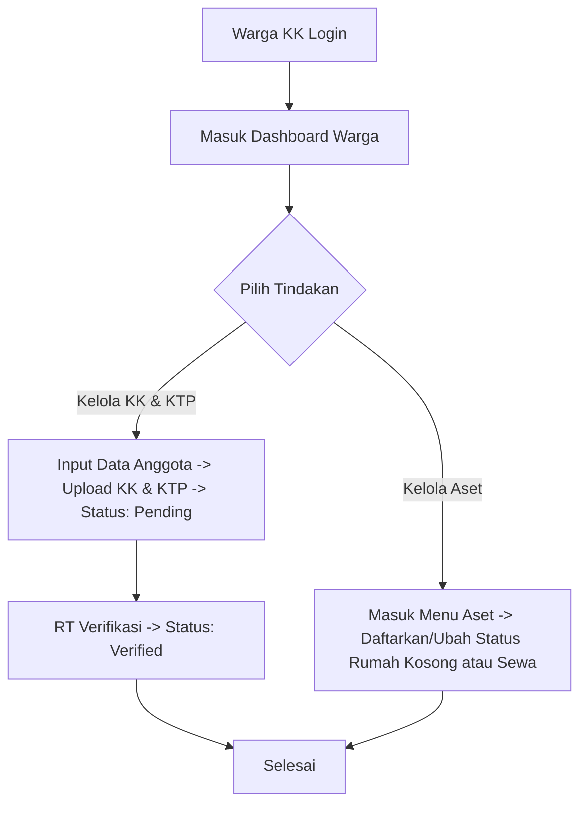
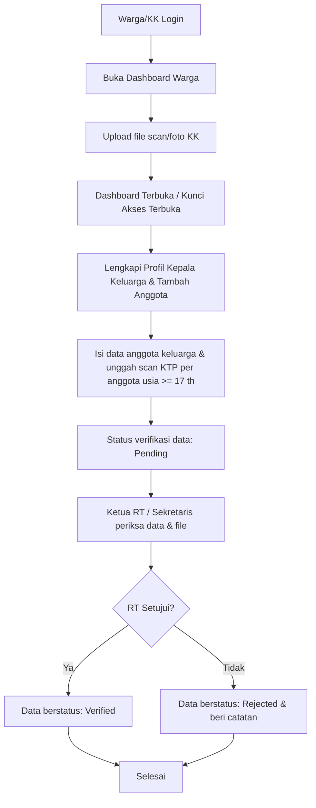

# Panduan Peran & Fitur: Warga (Kepala Keluarga)

Warga (Kepala Keluarga) adalah pengguna akhir utama sistem yang memiliki hak akses untuk melengkapi data anggota keluarganya secara mandiri, mengelola properti sewaan yang dimilikinya.

---

## 1. Navigasi & Struktur Menu (Sitemap)

Ketika Warga (Kepala Keluarga) login, menu utama meliputi:
*   **Beranda Dashboard Warga:** Tagihan iuran keluarga, ringkasan pengumuman internal, detail rumah tinggal, dan tautan cepat ke Form Pengaduan Publik.
*   **Administrasi Keluarga:** (Menu Utama)
    *   **Kelola Anggota Keluarga:** (Sub-menu) Form pengisian NIK, KK, data anggota, dan upload berkas KK/KTP.
    *   **Pencarian Warga & Peta Hunian:** (Menu Utama - Direct Link) Peta interaktif & pencarian tetangga ramah privasi (tersensor sebagian).
*   **Kelola Properti Pribadi:** (Menu Utama - Direct Link) Halaman utama pengelolaan seluruh aset properti sewaan yang dimiliki (Kos/Kontrakan/Homestay).
    *   *Desain Detil Halaman:* Menampilkan daftar kartu (cards) seluruh properti milik warga beserta tombol **`[+ Daftarkan Properti Baru]`**.
    *   *Aksi Detail Properti:* Mengklik salah satu kartu properti akan mengarahkan pemilik ke **Halaman Detail Properti** spesifik yang terbagi menjadi 3 Tab:
        1.  **Tab Kamar & Penghuni:** Menampilkan daftar kamar (Grid Kamar) dan penyewa aktif (Akses edit/tulis untuk Check-In/Out jika Pemilik adalah Koordinator langsung, atau akses Read-Only jika dikelola Koordinator lain).
        2.  **Tab Pengaturan Bisnis:** Menyetel jumlah kamar, nama properti, nomor kontak WA bisnis khusus, penunjukan Koordinator pengelola, dan mengunduh QR Code properti.
        3.  **Tab Riwayat Sewa:** Melacak histori tinggal mantan penyewa unit tersebut.

### 1.1 Penyatuan Menu Dinamis & Hak Akses Properti (Owner vs Coordinator)
Hak akses dan susunan menu sidebar akan beradaptasi secara dinamis berdasarkan hubungan antara **Pemilik Aset (Owner)** dan **Pengelola Aset (Coordinator)**:

1.  **Kasus A: Pemilik Mengelola Asetnya Sendiri (Owner == Coordinator)**
    *   *Siapa*: Warga Tetap (Kepala Keluarga) yang memiliki kos/kontrakan dan menjaganya sendiri.
    *   *Menu Sidebar*: Menu Warga Biasa + **`Kelola Properti Pribadi`** (Sebagai Pemilik & Koordinator sekaligus).
    *   *Hak Akses*: Di dalam **Tab Kamar & Penghuni**, dia memiliki akses menulis penuh (**Check-In/Out** penyewa). Dia *tidak membutuhkan* menu "Kelola Properti Sewa" (menu penjaga) karena semua tugasnya sudah terintegrasi di bawah menu aset pribadinya.
2.  **Kasus B: Pemilik Menunjuk Warga Tetap Lain Sebagai Koordinator (Owner != Coordinator, Pengelola adalah KK lain)**
    *   **Di Sisi Pemilik**:
        *   *Menu Sidebar*: Menu Warga Biasa + **`Kelola Properti Pribadi`** (Sebagai Pemilik).
        *   *Hak Akses*: Dia bisa mendaftarkan properti baru, mengganti koordinator, dan melihat iuran bisnis. Namun, di **Tab Kamar & Penghuni**, dia hanya memiliki akses **Read-Only** (hanya memantau penyewa aktif, karena hak Check-In/Out sudah diserahkan ke penjaganya).
    *   **Di Sisi Koordinator (Penjaga)**:
        *   *Menu Sidebar*: Menu Warga Biasa + **`Kelola Properti Sewa`** (Sebagai Koordinator).
        *   *Hak Akses*: Dia tidak bisa mengakses menu "Kelola Properti Pribadi" (karena bukan pemilik aset). Dia hanya bisa mengelola **Check-In/Out** kamar untuk unit-unit yang didelegasikan kepadanya oleh Pemilik.
3.  **Kasus C: Pemilik Menunjuk Orang Luar/Anak Kos Sebagai Koordinator (Owner != Coordinator, Pengelola bukan KK)**
    *   *Siapa*: Penjaga kos bayaran atau anak kos tepercaya yang bukan merupakan warga tetap RT setempat (tidak terdaftar di KK lokal).
    *   *Menu Sidebar*: Hanya menampilkan **Dashboard Utama Koordinator** + **`Kelola Properti Sewa`** (Tanpa menu kependudukan warga seperti Kelola Keluarga ).
    *   *Hak Akses*: Akses menulis penuh (**Check-In/Out**) kamar yang didelegasikan. Tidak bisa mengakses menu "Kelola Properti Pribadi".

*   **Role Switcher (Peralihan Tampilan):** Jika Warga Tetap terpilih menjadi pengurus RT (RT/Sekretaris/Bendahara), terdapat tombol di sudut kanan atas profil untuk beralih mode tampilan ("Panel Pengurus" $\leftrightarrow$ "Tampilan Warga") guna merubah susunan menu sidebar secara dinamis.
*   **Pemisahan Notifikasi Internal (Dalam Sistem):** Notifikasi lonceng disaring otomatis berdasarkan Mode Tampilan aktif (`category = 'personal'` saat mode warga, dan `category = 'dinas'` saat mode pengurus).

---

## 2. Fitur & Tugas Utama

*   **WR-01: Pendaftaran Mandiri Warga & Keluarga**
    *   **Tahap 1: Registrasi Akun Awal (Halaman Publik - Menunggu Verifikasi RT):**
        Warga menginput data berikut untuk membuat draf akun:
        *   `Nama Lengkap Kepala Keluarga` (Sesuai KTP)
        *   `NIK Kepala Keluarga` (16 digit angka, unik)
        *   `Nomor Kartu Keluarga (KK)` (16 digit angka, unik)
        *   `Nomor WhatsApp / HP` (Aktif untuk notifikasi WA)
        *   `Email` (Digunakan sebagai username login)
        *   `Password` (Dibuat warga secara mandiri)
        *   `Alamat Rumah` (Memilih nomor rumah terdaftar dari dropdown, atau input manual jika rumah baru)
        *   `Nomor Pintu/Unit` (Opsional, diisi jika tinggal di kontrakan berderet)
    *   **Tahap 2: Pengunggahan & Verifikasi Dokumen (Setelah Login - Akun Status Active):**
        *   **Kunci Akses Menu (Feature Gate):** Setelah login pertama kali, menu-menu lainnya di dashboard warga (seperti Kelola Properti Pribadi, Pencarian Warga) **terkunci (tidak aktif)**. Satu-satunya menu yang dapat diakses adalah Kelola Keluarga.
        *   Wajib melengkapi profil dan mengunggah dokumen berikut:
            *   `Berkas Scan KK` (Scan/foto Kartu Keluarga asli format JPG/PNG/PDF, maks 2MB)
            *   `Tanggal Mulai Tinggal (Check-In Date)` (Tanggal mulai menempati rumah)
        *   **Kondisi Pembukaan Kunci:** Kunci dashboard dan menu lainnya baru akan terbuka dan aktif secara otomatis **setelah berkas KK dan data anggota keluarga disetujui (status: Verified) oleh Ketua RT / Sekretaris**.
        *   **Menu Akses QR Code Rumah Tinggal:** Setelah status kependudukan diverifikasi (`Verified` oleh RT), Kepala Keluarga dapat melihat dan mengunduh QR Code rumah tinggalnya di **Menu: Dashboard Utama** -> Card **"Detail Rumah Tinggal"** -> Klik Tombol **`[Unduh QR Code Rumah]`**.
*   **WR-02: Kelola Anggota Keluarga (Lengkapi Profil Kepala Keluarga & Tambah Anggota)**
    *   **Otomatisasi & Kelengkapan Profil Kepala Keluarga:** Ketika akun diaktifkan oleh RT, sistem secara otomatis membuat baris pertama data anggota keluarga menggunakan Nama, NIK, dan hubungan `'Kepala_Keluarga'` dari registrasi awal. Warga tidak perlu mengetik ulang Nama dan NIK, tetapi **wajib mengedit data tersebut untuk melengkapi data yang belum diinput saat registrasi**, yaitu:
        *   `Jenis Kelamin` (Laki-laki / Perempuan - sangat penting untuk kasus kepala keluarga perempuan/istri karena suami meninggal atau bercerai).
        *   `Tempat Lahir` & `Tanggal Lahir`.
        *   `Berkas Scan KTP Kepala Keluarga` (Wajib diunggah).
    *   Menginput anggota keluarga lainnya (Istri, Anak, Orang Tua, dll.) satu per satu dengan data:
        *   `Nama Lengkap Anggota`
        *   `NIK Anggota` (16 digit angka, unik)
        *   `Tempat Lahir` & `Tanggal Lahir`
        *   `Jenis Kelamin` (Laki-laki / Perempuan)
        *   `Hubungan Keluarga` (Dropdown: Istri, Anak, Orang Tua, Lainnya)
        *   `Nomor HP / WhatsApp` (Opsional, untuk koordinasi darurat jika Kepala Keluarga tidak aktif)
        *   `Berkas Scan KTP Anggota` (Wajib diunggah jika usia $\ge$ 17 tahun)
    *   Memantau status verifikasi data kependudukan dari RT (Pending / Verified / Rejected + Catatan RT).
    *   **Aturan Penguncian Data & Perubahan Data (Verified Lock):**
        *   **Kondisi Terkunci (Read-Only):** Jika status verifikasi keluarga adalah `Verified`, seluruh data keluarga dan anggotanya akan dikunci secara otomatis. Tombol "Tambah", "Edit", dan "Hapus" anggota keluarga akan disembunyikan/dinonaktifkan untuk mencegah perubahan data sepihak.
        *   **Alur Pengubahan Data:** Warga yang ingin memperbarui data harus mengklik tombol **"Ajukan Perubahan Data"**. Tindakan ini akan mengembalikan status verifikasi menjadi `Pending` dan membuka kunci kolom input. Setelah warga selesai melakukan perubahan, Ketua RT / Sekretaris harus melakukan verifikasi ulang untuk mengembalikan status menjadi `Verified`.
*   **WR-03: Pemantauan Tagihan & Riwayat Iuran Keluarga**
    *   **Widget Status Iuran:** Kepala Keluarga memantau status iuran bulanan berjalan langsung pada widget di Beranda Dashboard:
        *   `Lunas` (Hijau) jika sudah membayar penuh.
        *   `Kurang` (Oranye) jika baru membayar sebagian (cicil) beserta sisa kekurangan rupiah yang harus dilunasi.
        *   `Belum Bayar` (Merah) jika belum menyetor sama sekali.
    *   **Pembedaan Label Tagihan (Wajib vs Sukarela):** Dashboard secara terpisah menyajikan tagihan kategori **Wajib** (masuk ke akumulasi tunggakan jika belum lunas) dan kategori **Sukarela** (donasi/sumbangan, tidak dianggap sebagai tunggakan hutang keluarga).
    *   **Informasi Tunggakan:** Menampilkan total nominal tunggakan wajib beserta daftar bulan tunggakan jika ada pembayaran yang terlewat di masa lalu.
    *   **Riwayat Transaksi:** Menampilkan log tanda terima digital pembayaran iuran yang telah diverifikasi oleh Bendahara sebagai arsip bukti pembayaran mandiri.
*   **WR-04: Kelola Properti Pribadi (Untuk Warga Pemilik Properti)**
    *   Mengajukan pendaftaran kos/kontrakan baru miliknya ke RT dengan menginput data:
        *   `Tipe Properti` (Dropdown: Kos-kosan / Kontrakan Berderet / Homestay [Sewa Harian])
        *   `Nama Properti` (misal: *Kos Melati*, *Villa Indah*)
        *   `Alamat Lengkap` (Nama Jalan/Blok)
        *   `Nomor Rumah` (Nomor fisik properti)
        *   `Jumlah Kamar / Pintu` (Total kapasitas hunian, disimpan di `total_rooms` pada tabel boarding_houses)
        *   `Nama Kontak Pengelola` (Nama penanggung jawab operasional kos/kontrakan, disimpan di `contact_person`)
        *   `Nomor HP/WA Bisnis Properti` (Nomor khusus untuk promosi/hubungi pengelola, terpisah dari nomor pribadi pemilik, disimpan di `phone`)
        *   `Penunjukan Pengelola (Koordinator)`:
            *   *Untuk Kos / Kontrakan:* Pilihan Kelola Sendiri [coordinator_user_id = ID Pemilik] atau Tunjuk Orang Lain [pilih akun warga aktif dari pencarian].
            *   *Untuk Homestay (Sewa Harian):* **Tidak memerlukan koordinator** karena tamu harian tidak di-sensus di aplikasi. Kolom penunjukan ini otomatis disembunyikan/dinonaktifkan.
        *   `Catatan Tambahan` (Opsional, misal: *Khusus Mahasiswi*, *Bebas banjir*)
    *   **Penunjukan Koordinator Properti Sewa (Pengelola):**
        *   Pemilik dapat menunjuk koordinator dari 3 unsur:
            1.  **Kelola Sendiri:** Pemilik sebagai koordinator langsung.
            2.  **Penyewa/Penghuni:** Memilih dari daftar penyewa aktif di properti sewa tersebut.
            3.  **Warga Setempat (Tetangga/Lainnya):** Memilih (hasil pencarian nama Warga) dari daftar warga aktif di wilayah RT tersebut (diambil dari database `family_members`).
        *   **Validasi & Otomatisasi Akun Login:**
            *   **Kasus A (Sudah Punya Akun):** Jika warga yang ditunjuk sudah memiliki akun `users` (misalnya dia adalah Kepala Keluarga), sistem langsung menautkan properti sewa ke akunnya tanpa membuat data baru.
            *   **Kasus B (Belum Punya Akun):** Jika yang ditunjuk adalah penyewa atau warga anggota keluarga biasa (non-KK) yang belum memiliki akun login, Pemilik wajib memasukkan **Email** aktif calon pengelola pada pop-up modal. Nama dan NIK akan ditarik otomatis dari database kependudukan. Sistem kemudian membuat baris akun baru berstatus `Pending` di tabel `users`.
            *   Setelah Ketua RT menyetujui penunjukan tersebut, status akun diubah menjadi `Active` dan tautan pembuatan password akan dikirim ke email koordinator baru.
    *   Mengubah status hunian menjadi "Kosong" (jika rumah lamanya ditinggal kosong) atau "Disewakan" (jika dikontrakkan).
    *   Memantau daftar penghuni aktif di propertinya secara *read-only*.
    *   **Menu Akses QR Code Aset Properti:** Pemilik properti dapat melihat dan mengunduh QR Code untuk setiap aset properti miliknya melalui **Menu: Kelola Properti Pribadi** -> Pilih salah satu properti -> Klik Tombol **`[Unduh QR Code Properti]`**.
*   **WR-05: Pencarian Warga & Peta Rumah**
    *   Setelah login, warga dapat mencari tetangga di wilayah RT melalui fitur pencarian di dashboard/homepage berdasarkan **Nama Warga** atau **Nomor Rumah**.
    *   Jika mencari berdasarkan Nomor Rumah, sistem menampilkan profil **Kepala Keluarga** (atau nama penyewa utama jika kos/kontrakan) yang mendiami rumah tersebut.
    *   Menampilkan informasi detail terbatas (Nama, hubungan/anggota keluarga, serta nomor rumah).
    *   **Penyensoran Privasi:** Untuk melindungi privasi antarwarga, data sensitif disensor dengan aturan:
        *   **NIK:** Hanya menampilkan 3 digit awal dan 3 digit akhir (contoh: `327**********001`).
        *   **Nomor HP:** Hanya menampilkan awalan `08` dan 3 digit terakhir (contoh: `08*******890`).
    *   Menampilkan **Peta Lokasi Rumah (Map)** interaktif yang terhubung ke koordinat rumah warga tersebut untuk memudahkan navigasi kunjungan sosial atau bantuan darurat.

---

## 3. Alur Kerja Utama (Flowchart)



---

## 4. Alur Kerja Detail (User Flow)

### 4.1 Flow Registrasi Mandiri & Login

```mermaid
flowchart TD
    A[Mulai Registrasi] --> B[User registrasi via form publik]
    B --> C[Sistem buat akun status: Pending]
    C --> D[Ketua RT / Sekretaris terima permohonan & verifikasi]
    D --> E{RT Setujui?}
    E -->|Ya| F[Status akun diubah menjadi Active]
    E -->|Tidak| G[Pendaftaran ditolak][User login pertama kali]
    H --> I[Akses menu dashboard terkunci sebelum upload KK]
    I --> J[Ganti password default jika dibuatkan admin / langsung ke upload KK]
    J --> K[Selesai]
```

### 4.2 Flow Lengkapi Data & Upload KK/KTP (Kepala Keluarga)



### 4.3 Flow Pencarian Warga & Peta Rumah (Setelah Login)

```mermaid
flowchart TD
    A[Warga Terverifikasi Login] --> B[Buka Fitur Pencarian Warga]
    B --> C[Cari berdasarkan Nama atau Nomor Rumah]
    C --> D[Tampilkan detail terbatas tetangga:<br>- Nama Warga & Hubungan Keluarga<br>- Nomor Rumah & Alamat<br>- NIK disensor 3-awal/3-akhir<br>- Nomor HP disensor 08-awal/3-akhir]
    D --> E[Tampilkan Peta Lokasi Rumah (Map) interaktif]
    E --> F[Selesai]
```

### 4.4 Flow Penunjukan Koordinator Properti Sewa

```mermaid
flowchart TD
    A[Pemilik Properti Login] --> B[Buka Detail Properti Kos/Kontrakan]
    B --> C{Pilih Calon Koordinator}
    
    C -->|Opsi 1: Dari Anak Kos Aktif| D[Pilih nama Anak Kos]
    C -->|Opsi 2: Dari Warga Setempat| E[Pilih nama Warga Aktif dari data RT]
    
    D --> F{Apakah NIK calon sudah punya akun di tabel users?}
    E --> F
    
    F -->|Ya, Sudah Ada Akun| G[Tautkan Properti ke ID User tersebut]
    G --> H[Kirim Pengajuan Penunjukan ke Ketua RT]
    
    F -->|Tidak, Belum Ada Akun| I[Tampilkan Pop-Up Modal: Input Email Baru]
    I --> J[Kirim Pengajuan Pembuatan Akun & Penunjukan ke RT]
    Note over J: Akun baru dibuat berstatus PENDING di tabel users
    
    H --> K[Ketua RT Periksa Pengajuan]
    J --> K
    
    K --> L{Apakah RT Menyetujui?}
    
    L -->|Ya| M{Apakah akun berstatus PENDING?}
    M -->|Ya| N[Ubah status users menjadi ACTIVE & kirim email aktivasi password]
    M -->|Tidak| O[Langsung hubungkan properti ke user]
    N --> P[Koordinator login -> Akses Kelola Kos/Sewa aktif]
    O --> P
    
    L -->|Tidak| Q[RT klik 'Tolak' & tulis alasan]
    Q --> R[Notifikasi penolakan dikirim ke Pemilik Kos]
    
    P --> S[Selesai]
    R --> S
```
